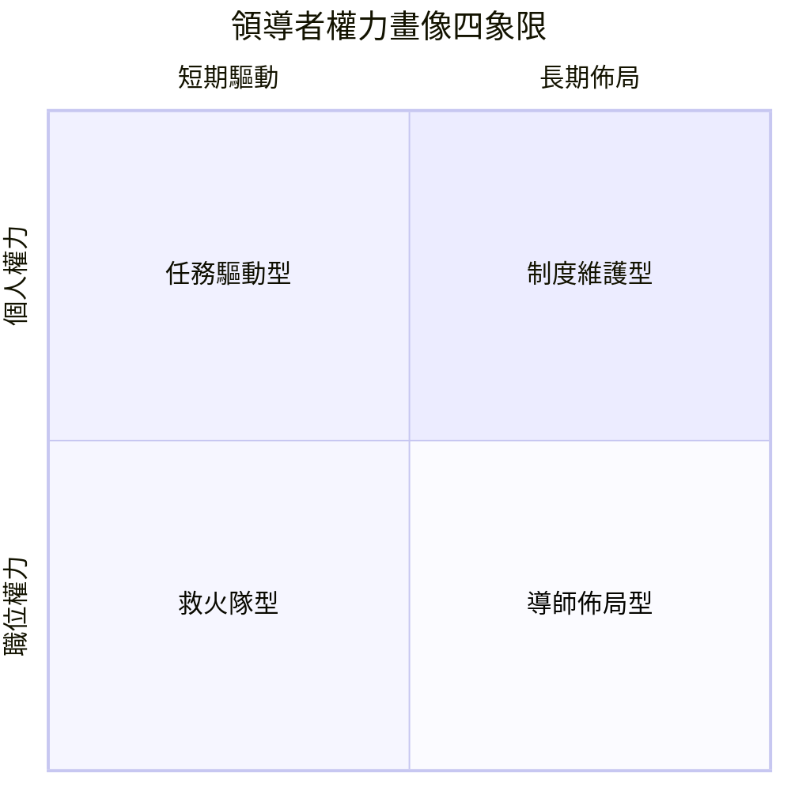

# 職場站隊的底層邏輯 — 給 Junior 的生存與選擇框架

> **「不選邊，本身就是一種選邊。」** 這不是厚黑學，而是組織運作的基本事實。本篇教你用權力架構的眼光看懂局，在保護自己的同時做出理性選擇。

---

## 1. 開局：為什麼「站隊」是必修課，不是厚黑學

很多人聽到「站隊」兩個字就皺眉，覺得這是政治鬥爭、小人行徑。我懂，我在職場前三年也是這麼想的。

後來我才明白：**你以為你不沾鍋，其實你只是把選擇權交給了別人。**

組織的本質是資源分配，只要資源有限，就有優先級；只要有優先級，就有權力運作。你不需要主動參與政治，但你必須理解政治——就像你不需要成為氣象學家，但出門看天氣是基本常識。

這篇文章不是要教你去鬥誰、踩誰，而是給 Junior 三個核心能力：

1. **看得懂局** — 知道組織裡的權力長什麼樣子
2. **選得對邊** — 判斷誰值得跟、誰該遠離
3. **站得穩腳** — 不把自己綁死在一艘船上

---

## 2. 權力地圖：看懂組織裡的六種權力

在開始判斷「站誰」之前，你必須先看懂「權力」長什麼樣。社會心理學家 French 與 Raven 提出的六種權力基礎，至今仍然是職場分析最實用的框架。

### 職位面（Positional Power）

這三種權力來自組織給你的位置，跟你這個人無關。

> [!IMPORTANT] 重要理解
> 職位面的權力是「借來的」— 換掉這個人，權力就轉移給下一個人。不要因為頭銜就誤以為對方無所不能。

**強制權（Coercive Power）**

有能力對你施加負面後果：調職、砍預算、打考績、冷凍。這是最原始也最危險的權力形式。

- **識別信號**：常用「不…就…」句式，喜歡拿考績說事。
- **應對**：按時交付、降低把柄。但長期來說，這種主管不值得深跟。

**獎賞權（Reward Power）**

有能力給你想要的東西：加薪、升遷、好 project、彈性工時。

- **識別信號**：他手上真的有 allocation 的實權嗎？很多人掛著獎賞權的招牌，實際上什麼也給不了。
- **應對**：搞清楚他給不給得出來。只開支票不兌現的，權力是虛的。

**法定權（Legitimate Power）**

因為職位頭銜而擁有的決策權。他是你主管，所以他可以決定某些事。

- **識別信號**：在流程上簽核、在架構上有匯報線。
- **應對**：尊重流程，但要有「法定權不等於正確」的心理準備。

### 個人面（Personal Power）

這兩種權力來自這個人本身，換了公司依然帶著走。

**專家權（Expert Power）**

因為專業能力無可取代而擁有的影響力。這是最純粹、最值得長期投資的權力。

- **識別信號**：重大決策會找他技術諮詢，沒他拍板 team 不敢動。
- **應對**：緊緊跟著學。專家權的領導者通常不會搞政治，因為不需要。

**參照權（Referent Power）**

因為人格魅力、信任度、人望而讓人願意跟隨。人家聽他的，不是因為頭銜，是因為「他這個人值得信」。

- **識別信號**：跨部門的人都願意幫他忙，他講話時大家會安靜聽。
- **應對**：這是 CP 值最高的站隊對象——跟對一個人，等同開啟整個網絡。

**信息權（Information Power）**

因為掌握關鍵資訊而有影響力。知道老闆在想什麼、知道哪個 project 要被砍了、知道誰在布局什麼。

- **識別信號**：消息靈通，常常「剛好」提到即將發生的事。
- **應對**：建立互惠關係。但要小心——信息權容易被誤用為操控，資訊來源要交叉驗證。

---

## 3. 四象限：領導者權力畫像與對策

有了六種權力的基礎，接下來用一個二維座標來分類你的領導者。

> [!TIP] 使用方式
> 坐標沒有絕對好壞，重點是辨識出來後用對應策略。選錯策略比選錯邊更常見。

### 象限 I：短期 × 職位權力 —「任務驅動型」

**典型特徵**：只看結果、不管過程。KPI 至上、短期衝刺、週報要數字。權力來源主要是強制權 + 獎賞權。

**對策**：
- 精準交付，不談忠誠。他只需要你完成任務。
- 所有溝通留下書面紀錄。這類領導者在壓力來時容易甩鍋。
- 把這裡當跳板，學完東西就準備走。

### 象限 II：長期 × 職位權力 —「制度維護型」

**典型特徵**：重視流程、階級、穩定。走路都有 SOP，升遷看年資。

**對策**：
- 成為系統內不可或缺的角色，但不是不可取代的那個（不可取代會讓他覺得被威脅）。
- 理解並遵守規則，再在規則內找縫隙。
- 晉升速度慢但穩定，適合想要安穩發展的人。

### 象限 III：短期 × 個人權力 —「救火隊型」

**典型特徵**：明星氣質、擅長危機處理、能見度很高但沒有長期規劃。權力來源主要是信息權 + 個人魅力。

**對策**：
- 跟緊節奏，享受快速成長，但要有自己的判斷力。
- 這類領導者可能說變就變，不要把所有賭注押在他一個人身上。
- 把這段經歷當作「快速累積能見度」的手段。

### 象限 IV：長期 × 個人權力 —「導師佈局型」

**典型特徵**：願意教你、給你舞台、讓你在關鍵場合曝光。他們是組織內最有影響力的人，不需要靠權術壓人。

**對策**：
- 這是最值得深跟的類型。用忠誠換栽培，用執行力換信任。
- 建立「能力複利」— 讓他願意持續在你身上投資。
- 離開這間公司後，他依然會是你重要的業界人脈。

---

## 4. 實戰紅綠燈：該靠攏 vs 該遠離的信號

理論講完了，來點實際的。這些是你可以觀察的具體行為。

### 🟢 綠燈信號（可以靠攏）

- **公開給你 credit** — 在老闆面前說這是你的功勞，而不是攬在自己身上。
- **給高能見度的任務** — 讓你去簡報、去跨部門協作、去面對客戶。
- **保護你不必擋刀** — 上層的火燒下來時，他會扛而不是往下推。
- **給真實回饋** — 私下跟你說哪裡可以更好，而不是公開檢討。

### 🔴 紅燈信號（立刻遠離）

- **功勞全拿、鍋全甩** — 好的都是他的，壞的都是你的。
- **資訊封鎖** — 關鍵會議不通知你、Mail 把你 BCC 掉。
- **讓你背黑鍋** — 出了問題才說「你知道這件事吧？」
- **情緒勒索** — 用忠誠度、年資、人情來壓你接受不合理要求。
- **拉你站台但不上檯面** — 要你去鬥別人，但真出事他不會保你。

> [!IMPORTANT] 紅燈處理原則
> 看到紅燈之後，不要馬上翻臉。開始：
> 1. 書面存檔所有關鍵溝通
> 2. 低調建立跨部門關係
> 3. 更新履歷，開始看機會
> 4. 在離職之前，保持專業、不撕破臉

---

## 5. 安全邊界：站隊但不綁死

你再會選邊，也無法保證那艘船不會沉。所以你要做的是：

### 備援關係網

不要只押一個領導者。在公司內部至少維持 **3 條不同的關鍵關係**：
- 你的直屬主管
- 一個跨部門的資深同事
- 一個比你高兩層級但關係良好的長官

誰知道你離職後誰會在哪？人脈是最不需要成本的保險。

### 個人品牌護城河

站隊的對立面不是獨善其身，而是**讓自己強到別人來找你**。

持續做的事：
- 在公司內外累積專業成果（部落格、專案、社群貢獻）
- 讓市場知道你的身價
- 讓「跳槽」成為你的 real option，而不只是威脅

當你有選擇權，你就不需要依附任何人。

### 停損點與退場機制

為自己設定條件：
- 如果連續三次被搶功，就開始看機會
- 如果主管開始對你說謊，就啟動備案
- 如果團隊文化開始明顯有害，三個月內走人

不要等身心俱疲才走。**職場上最好的退場時機，是在你還能笑著離開的時候。**

---

## 6. 總結：站隊的最終目的是「不需要站隊」

寫到這裡，你可能會覺得矛盾——前面教你分析權力、辨識領導者、選邊站，最後卻說不需要站隊？

不矛盾。

> [!SAGE] 核心心法
> 站隊是過程，不是目的。目的是讓你有足夠的資本，不再需要依附任何人。

當你具備了：
- 業界稀缺的專業能力（專家權）
- 值得信任的個人品牌（參照權）
- 廣泛的人脈網絡（信息權 + 關係）

你就成為了那個「別人想拉攏你，但你不需要選邊」的人。

在那之前，先活下去、先看懂局、先生存。

然後，讓自己成為那個局。

---

> 延伸閱讀：
> - [French & Raven 權力基礎理論（原文）](https://en.wikipedia.org/wiki/French_and_Raven%27s_bases_of_power)
> - 《權力與影響力》John P. Kotter
> - 《横向領導力》Roger Fisher

## 相關主題

> - 用四個維度評估公司值不值得繼續拚？參考 [[Dictums/company-worth-matrix|公司價值評估：4 維度 1 矩陣]]
