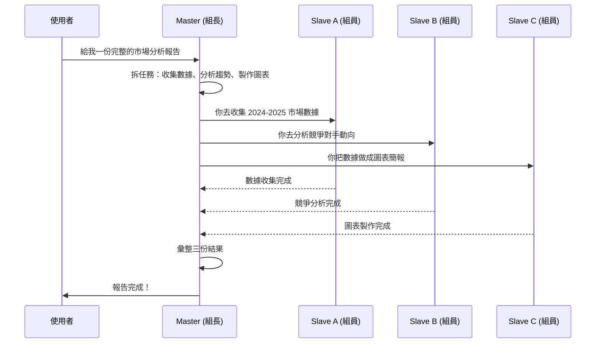
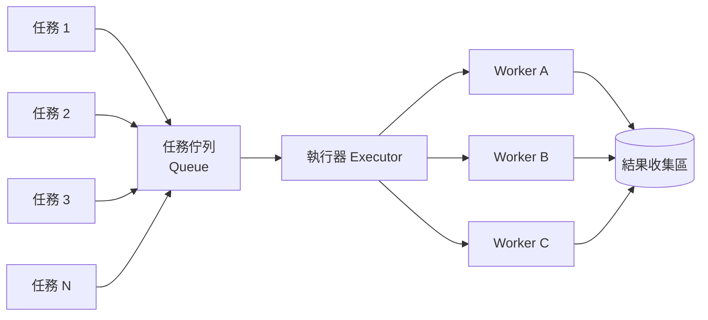
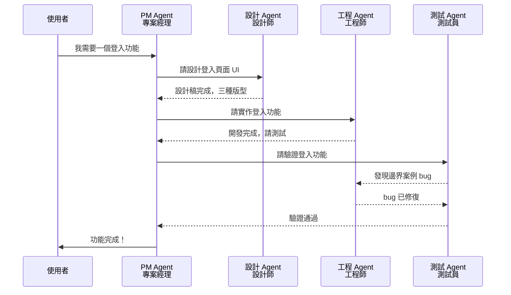
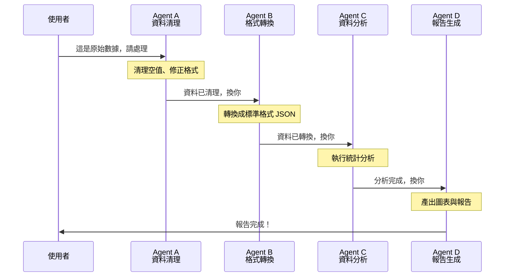

# 🤖 多 Agent 協作模式

> 如果說 [[Grimoires/harness-engineering|⚙️ Harness Engineering]] 是教你把一個 AI Agent 訓練成聽話的好員工，那這篇就是教你：**當你需要同時用好幾個 AI 的時候，要怎麼讓他們不打架、不出包。**

## 一、為什麼需要多個 Agent？

一個 AI Agent 能力有限。就像一個人沒辦法同時寫程式、畫設計稿、測 bug 還要回客戶訊息。

當任務變複雜，你就需要分工：

- 有些 Agent 擅長搜尋資料
- 有些 Agent 擅長寫程式
- 有些 Agent 擅長檢查品質

問題來了——**要怎麼安排他們工作？**

以下四種模式，就是最常見的安排方式。

---

## 二、模式一：主從模式 — 「一個組長，多個組員」

**一句話**：組長（Master）拆任務派給組員（Slave），組員做完回報。

### 流程長這樣

### 優點
| 項目 | 說明 |
|------|------|
| ✅ 管理簡單 | 誰負責什麼很清楚 |
| ✅ 流程透明 | 組長掌握全局，進度可追蹤 |
| ✅ 結果好彙整 | 最後由組長統整，輸出一致 |

### 缺點
| 項目 | 說明 |
|------|------|
| ❌ 組長是瓶頸 | 組長忙不過來，整組就慢 |
| ❌ 單點故障 | 組長掛了，組員全部閒置 |
| ❌ 組員被動 | 只能等組長派工，不主動 |

### 適合做什麼
- 需要統一彙整結果的報告生成
- 批次處理（一次發多個任務出去）
- 測試案例大量並行執行

---

## 三、模式二：執行緒模式 — 「工單櫃檯，隨到隨辦」

**一句話**：任務排隊進櫃檯，哪個窗口空了就處理。

### 流程長這樣

### 優點
| 項目 | 說明 |
|------|------|
| ✅ 吞吐量高 | 同時可以處理很多任務 |
| ✅ 動態擴充 | 任務多就加開窗口，減少就縮編 |
| ✅ 資源共享 | 大家共用同一個任務佇列，沒人閒著 |

### 缺點
| 項目 | 說明 |
|------|------|
| ❌ 誰做了什麼難追 | 每件任務可能是不同 Worker 處理的 |
| ❌ 會打架 | 兩個 Worker 同時改同一筆資料就出包 |
| ❌ 除錯痛苦 | 錯誤發生時，不知道是哪個 Worker 在什麼時間點造成的 |

### 適合做什麼
- 大量獨立任務（例如發送通知信、圖片轉檔）
- 不需要保證順序的工作
- 需要高吞吐的批次系統

---

## 四、模式三：跨部門合作模式 — 「專案團隊，各司其職」

**一句話**：不同專長的 Agent 各自負責一段，互相討論、接力完成。

### 流程長這樣

### 優點
| 項目 | 說明 |
|------|------|
| ✅ 專業分工 | 每個 Agent 只做自己擅長的，品質高 |
| ✅ 容錯高 | 設計 Agent 壞了不影響工程 Agent |
| ✅ 可來回討論 | 發現問題可以退回前一站修正 |

### 缺點
| 項目 | 說明 |
|------|------|
| ❌ 溝通成本高 | 分工越細，等待回覆的時間越長 |
| ❌ 規格模糊就卡住 | 需求沒寫清楚，大家來回空轉 |
| ❌ 沒人扛全局 | 如果 PM Agent 沒做好整合，容易各自為政 |

### 適合做什麼
- 需要多種專業的任務（客服+分析+回報）
- 需要反覆驗證與迭代的流程
- 品質要求高的情境

---

## 五、模式四：工作流模式 — 「生產線，一站傳一站」

**一句話**：Agent 串成一條生產線，前一站做完自動觸發下一站，像火車一路開下去。

### 流程長這樣

### 優點
| 項目 | 說明 |
|------|------|
| ✅ 流程好預測 | 順序固定，不會亂跳 |
| ✅ 每站專心一件事 | Agent 不用會全部技能，做好自己的部分就好 |
| ✅ 中斷點明確 | 卡在哪一站一看就知道 |

### 缺點
| 項目 | 說明 |
|------|------|
| ❌ 前一站塞車後面全堵 | 如果 A 很慢，B、C、D 全部空等 |
| ❌ 不能跳站 | 不能跳過某一步，流程僵化 |
| ❌ 改流程麻煩 | 要加站或換順序，整條生產線要調整 |

### 適合做什麼
- 步驟固定的 ETL 流程（擷取 → 清理 → 轉換 → 儲存）
- 標準化的文件處理流程（收件 → 審核 → 簽核 → 歸檔）
- 需要保證執行順序的任務

---

## 六、一句話總結：怎麼選？

不需要花時間分析，直接看情境對號入座：

| 你的情境 | 選這個模式 |
|----------|-----------|
| 有明確指揮者，任務可以平分出去 | **主從模式** |
| 任務量大、獨立、不須排順序 | **執行緒模式** |
| 需要多種專業協作、要來回溝通確認 | **跨部門模式** |
| 任務有固定步驟，一步做完才能做下一步 | **工作流模式** |

### 四個模式一眼看懂

| 面向 | 主從模式 | 執行緒模式 | 跨部門模式 | 工作流模式 |
|------|---------|-----------|-----------|-----------|
| 控制力 | ⭐⭐⭐⭐⭐ | ⭐⭐⭐ | ⭐⭐⭐⭐ | ⭐⭐⭐⭐⭐ |
| 吞吐量 | ⭐⭐⭐ | ⭐⭐⭐⭐⭐ | ⭐⭐ | ⭐⭐⭐ |
| 靈活性 | ⭐⭐⭐ | ⭐⭐⭐⭐ | ⭐⭐⭐⭐⭐ | ⭐⭐ |
| 容錯能力 | ⭐⭐ | ⭐⭐⭐ | ⭐⭐⭐⭐ | ⭐⭐ |

### 實務上怎麼用？

其實這四種模式**不一定要選一種**。實務上最常見的做法是**混搭**：

> 用主從模式定大局，裡面的子任務再用執行緒模式平行處理。

或是：

> 用工作流模式串流程，但其中某一站內部用跨部門模式讓多個專家協作。

沒有標準答案，只要團隊溝通順暢、不出包，就是好模式。

---

> 💡 **延伸閱讀**：
> - 想理解怎麼把一個 Agent 訓練好？參考 [[Grimoires/harness-engineering|⚙️ Harness Engineering]]
> - 想理解怎麼給 Agent 足夠的背景知識？參考 [[Grimoires/context-engineering|🧠 Context Engineering]]
> - 想理解 Prompt 怎麼下才精準？參考 [[Grimoires/ai-prompts-guide|AI提示詞完全攻略]]
