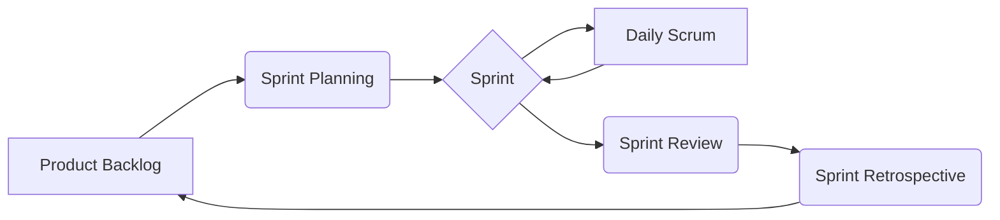

# 🏃 Scrum 衝刺儀式：敏捷開發的策略法典
**Scrum 是一種迭代漸進式的戰術框架，旨在靈活應對變幻莫測的需求戰場。透過自適應的短週期迭代，確保團隊能持續交付價值。**

## 核心概念：瀑布 vs. Scrum
在產品開發的戰場上，存在兩大主要流派：

- **瀑布模型 (Waterfall)**：線性的開發路徑，如同溪水向下游流動，一旦通過審核便難以逆流。適合需求極度穩定的靜態契約，但在變動頻繁的現代戰場中，容易因需求僵化導致延遲風險。
- **Scrum 框架**：具備自適應、快速與靈活的特性。它將龐大的任務拆解為細小的區塊，在短週期（Sprint）內交付可運行的產品增量。

> [!SAGE] 三大支柱 (The Three Pillars)
> 1.  **透明度 (Transparency)**：確保團隊對「完成」有共同理解。
> 2.  **檢查性 (Inspection)**：定期審視成果與流程，發現潛在破綻。
> 3.  **適應性 (Adaptation)**：根據結果即時調整策略，確保交付符合預期。

---

## 神聖職責：角色分工與禁忌
Scrum 團隊由三種核心角色組成，每種角色都有其神聖的職責與必須遵守的「禁忌」。

### 1. Scrum Master (儀式導師)
- **僕人式領導**：負責排除任何干擾團隊生產力的阻礙。
- **守護者**：確保團隊理解並實踐 Scrum 價值觀。
- **🚫 法典禁忌**：不可成為指揮官下達指令、不可干預技術細節、不可與 PO 為同一人。

### 2. Product Owner (產品負責人)
- **價值決策者**：代表市場與客戶的聲音，負責最大化產品的商業價值。
- **卷軸管理者**：定義產品願景並排序「產品待辦卷軸 (Product Backlog)」。
- **🚫 法典禁忌**：不可僅作為需求的「傳聲筒」、不可干預團隊「如何」實現工作。

### 3. Development Team (開發小隊)
- **自組織與跨職能**：具備交付產品增量所需的所有技能組合。
- **集體承擔**：不設個人頭銜，共同對 Sprint 的產出負責。
- **🚫 法典禁忌**：不可有個人英雄主義、不可在內部設立階級制度。

---

## 核心循環：衝刺儀式 (Sprint)
**Sprint** 是儀式的核心，通常為期 **1-4 週**。其本質是一個固定的**時間盒 (Timebox)**。

### 衝刺週期工作流

### 五大核心活動
1.  **衝刺規劃 (Sprint Planning)**：確定本次衝刺的目標，並挑選合適的待辦事項。
2.  **每日共鳴 (Daily Scrum)**：每日 15 分鐘的站會，同步進度、協調計畫並排除障礙。
3.  **衝刺審查 (Sprint Review)**：向利害關係人展示可運行的增量成果，獲取即時回饋。
4.  **衝刺回顧 (Sprint Retrospective)**：反思團隊的協作流程，找出下一個衝刺的優化方向。
5.  **梳理儀式 (Backlog Refinement)**：在衝刺期間持續釐清並排序待辦事項。

> [!CAUTION] 衝刺守則
> - 衝刺期間**嚴禁變更目標**，以免干擾團隊的聚焦力。
> - 只有 Product Owner 有權在目標過時的情況下取消衝刺。

---

## 能量量度：故事點數與容量規劃
團隊透過以下兩種方法估算工作量，確保衝刺目標具備可行性：

### 1. 基於容量 (Capacity-based)
計算團隊在特定衝刺中可用的總工作時數。
`團隊容量 = 人數 × 每日工時 × 衝刺天數 × 專注因子`
- **專注因子 (Focus Factor)**：建議範圍 0.6 ~ 0.8。初期建議從 0.6 開始估算。

### 2. 基於速度 (Velocity-based)
參考團隊過去 3-5 個衝刺平均完成的故事點數。這反映了團隊的經驗交付能力。

---

## 品質基準：工件與 DoD
### Scrum 工件 (Artifacts)
- **產品待辦卷軸 (Product Backlog)**：按優先順序排列的所有需求清單。
- **衝刺待辦清單 (Sprint Backlog)**：當前週期內承諾要完成的任務。
- **燃盡圖 (Burndown Chart)**：追蹤進度的視覺化工具。

### 完成的定義 (Definition of Done, DoD)
這是團隊與利害關係人對「完成」的**共同契約**。
- 只有符合 DoD 的項目才能算作「潛在可發布增量」。
- **持續進化**：DoD 會隨著團隊成熟而擴展（例如：加入自動化測試或安全性檢查）。

---

## 總結：敏捷的核心在於適應
Scrum 不是一套死板的規則，而是一種**持續演化的文化**。透過透明、檢查與適應，團隊能將混亂的開發過程轉化為有節奏的、高價值的穩定產出。

---

## 相關主題

> 💡 **延伸閱讀**：
> - 設定明確的衝刺目標？參考 [[Grimoires/smart-principles|SMART 符文：精準任務目標設定]]
> - 進行高效的衝刺會議？參考 [[Grimoires/efficient-meeting-methodology|高效會議完全攻略：精神鏈接法]]
> - 工作回顧與戰鬥復盤？參考 [[Grimoires/work-review-methodology|工作復盤：經驗值獲取與持續優化]]
