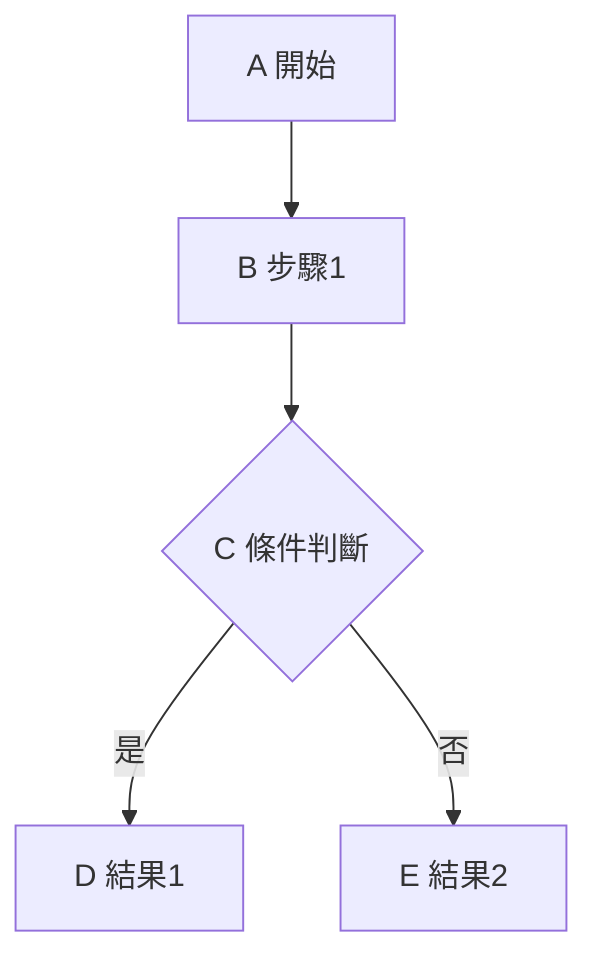
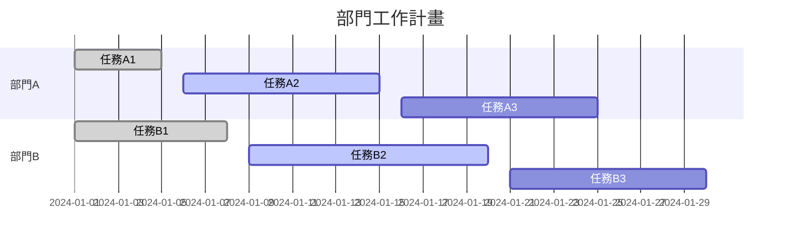
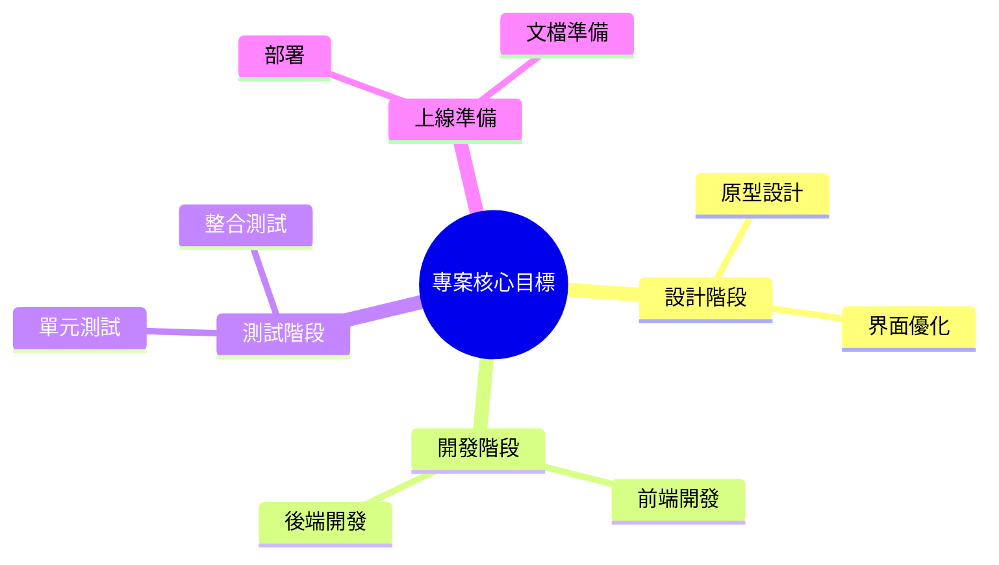
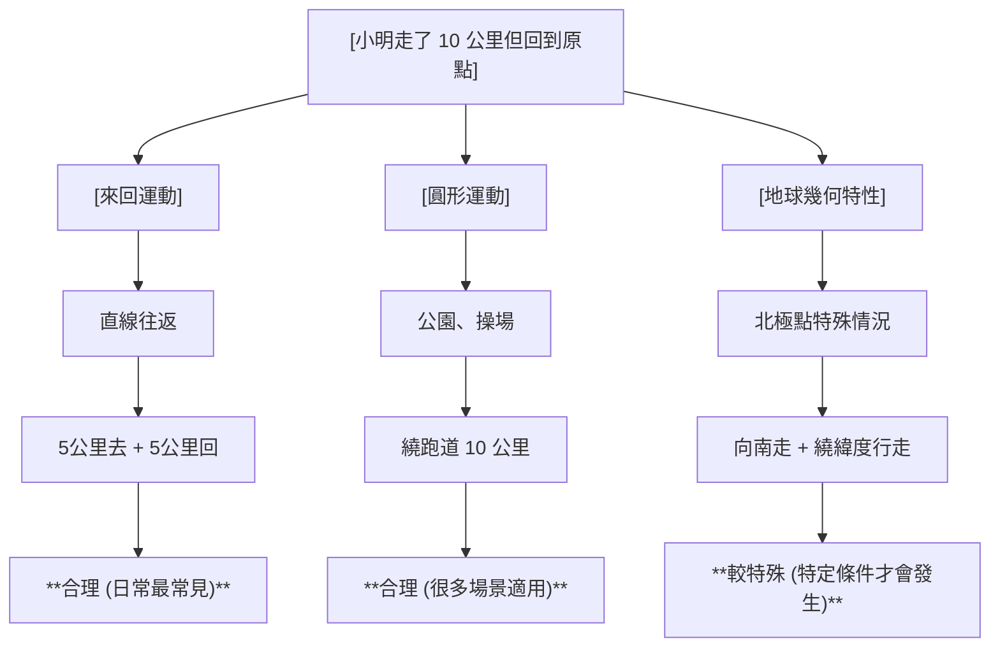
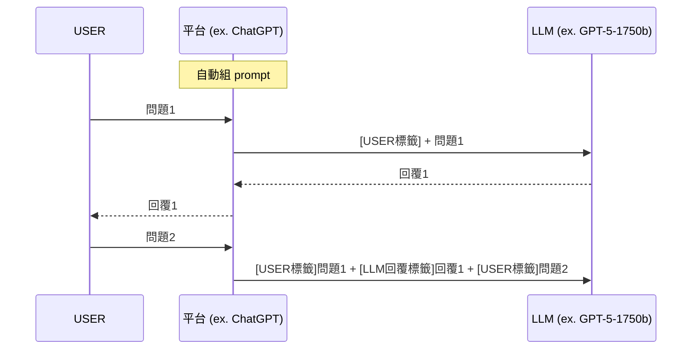

# 🤖 生成式 AI 與提示工程


## 評分佔比
- **課程參與及出席 (10%)**：包含四次視訊面授、面授互動、數位教材觀看進度。
- **平時作業 (20%)**：第一次與第二次作業各佔 10%。
- **期中報告 (30%)**：評分標準為情境敘述完整性、創新度、豐富度。
- **期末報告 (40%)**：評分標準為提示工程演練結果與框架對應說明。

## 重要期限
- **作業繳交截止**：2026/05/22 (五) 23:59:59
- **期中/期末報告上傳截止**：2026/06/05 (五) 23:59:59
- **數位教材觀看統計截止**：2026/06/05 (五) 23:59:59

## 核心規定
- **補救措施**：
    - 面授缺席：需請假並於兩週內繳交心得報告，分數以 80% 計算。
    - 逾期繳交（作業/報告）：一週內可補交，分數以 80% 計算。
- **報告要求**：設定日常應用情境，運用提示工程由 ChatGPT 生成內容並調整至最佳結果。

# 作業詳細內容

### 作業一：GAI 議題討論 (10%)

- **階段一 (115/03/27 前)**：於數位學習平台討論板發表一則生成式 AI 相關議題，標題需以 `[GAI 議題]` 開頭。[[SageTower/generative-ai-prompting homeWork1|作業一：GAI 議題討論]]
- **階段二 (115/04/12 前)**：回應至少一則同學發表的議題，並進行趣味程度評分。
- **最終繳交 (115/05/22 前)**：將上述流程截圖並填寫於「作業一填答卷」後上傳至平台。

### 作業二：提示工程演練 (10%)

- **階段一 (115/04/24 前)**：於討論板發表一則提示工程應用情境演練結果與心得，標題需以 `[提示工程演練]` 開頭。[[SageTower/generative-ai-prompting homeWork2|作業二：提示工程演練]]
- **階段二 (115/05/10 前)**：回應至少一則同學的演練結果，並填寫收穫評分。
- **最終繳交 (115/05/22 前)**：將上述流程截圖並填寫於「作業二填答卷」後上傳至平台。

#  AI 基礎概念

- **人工智慧 (AI, Artificial Intelligence)**：廣義的學科，目標是讓機器模擬人類智能。
    - _範例：深藍（Deep Blue）西洋棋程式。_
- **判別式人工智慧 (DAI, Discriminative Artificial Intelligence)**：重點在於從數據中學習規律，進行分類或預測。
    - **機器學習 (ML)**：AI 的子集，從數據中自動學習。_範例：垃圾郵件自動過濾。_
        - **深度學習 (DL)**：ML 的子集，利用多層神經網路處理複雜模式。_範例：手機的人臉辨識解鎖。_
- **生成式人工智慧 (GAI, Generative Artificial Intelligence)**：深度學習的最前沿應用，能創造出全新的內容。
    - 範例：使用 ChatGPT 撰寫報告或用 Midjourney 生成圖片。

### 判別式AI VS 生成式AI
- **判別式人工智慧 (DAI, Discriminative Artificial Intelligence)**：核心為「分類與判斷」。
    - **目標**：進行資料標記（例如：辨識這張圖是貓還是狗）。
    - **關鍵概念**：特徵提取與分類，擅長處理「選擇題」。
    - **應用場景**：垃圾郵件過濾、人臉辨識、股市預測、推薦系統。
- **生成式人工智慧 (GAI, Generative Artificial Intelligence)**：核心為「創造與建模」。
    - **目標**：理解組成結構，進而「畫出」或「創造」全新內容。
    - **關鍵概念**：內容分佈 (Distribution)，擅長處理「申論題」。
    - **應用場景**：ChatGPT (文本)、Midjourney (影像)、Suno (音樂)。

### 生成式AI基本觀念

- **概率預測 (Next Token Prediction)**：GenAI 並非真正思考，而是依據統計機率預測下一個字或像素，這也是產生「幻覺」（一本正經地胡說八道）的原因。
- **潛在空間 (Latent Space)**：一個抽象的高維空間，將萬物轉化為座標 (Embedding)。提示工程的本質就是引導 AI 在此空間中找到我們想要的那個「點」。
- **從「確定性」到「機率性」 (Deterministic vs. Probabilistic)**：
    - 傳統軟體：確定性，輸入 A 必得到 B。
    - GenAI：機率性，同樣的輸入可能得到不同的結果。
- 提示工程：核心作用在於「穩定輸出」，減少不確定性。

### ChatGPT 使用用途統計

根據 API 提示詞數據集統計，使用用途分佈如下：
1. **生成 (Generation)**：45.6%
2. **開放式問答 (Open QA)**：12.4%
3. **腦力激盪 (Brainstorming)**：11.2%
4. **聊天 (Chat)**：8.4%
5. **改寫 (Rewrite)**：6.6%
6. **摘要 (Summarization)**：4.2%
7. **分類 (Classification)**：3.5%
8. **其他 (Other)**：3.5%
9. **封閉式問答 (Closed QA)**：2.6%
10. **擷取 (Extract)**：1.9%

### 人工智慧發展四階段

- **第一階段 (1950-1960) 符號邏輯**：把人類思考邏輯放進電腦。
    - _範例：西洋棋程式、邏輯證明器。_
- **第二階段 (1980-1990) 專家系統**：把人類知識規則放進電腦。
    - _範例：MYCIN 醫療診斷系統、法律諮詢系統。_
- **第三階段 (2010-2022) 機器學習**：把人類所有看見放進電腦。
    - _範例：AlphaGo、人臉辨識、推薦演算法（如 Netflix 推薦）。_
- **第四階段 (2022-Present) 生成創造**：把人類認知創意放進電腦。
    - _範例：ChatGPT、Midjourney、Suno。_

### 自然語言處理 (NLP) vs 大語言模型 (LLM)

- **NLP (Natural Language Processing) ——「領域與學科」**
    - **定義**：人工智慧與語言學的交集，目標是讓電腦「理解、分析、生成」人類語言。
    - **傳統做法**：注重語法規則，如詞性標註、斷詞、情感分析。
    - **局限性**：屬於「專才」，一個模型通常只能執行單一任務（如翻譯機器人無法寫詩）。
- **LLM (Large Language Model) ——「強大的工具與引擎」**
    - **定義**：NLP 領域在深度學習階段的產物，利用海量數據訓練出的巨型模型。
    - **核心特質**：規模極大（數千億參數、全互聯網文本），從專才進化為「全才」。
    - **運作原理**：基於機率預測下一個字（例如：台灣最高的山  玉  山）。

#### 關鍵技術：Transformer

- **定義**：這是現代 LLM 的核心架構（如 GPT 中的 "T"），取代了早期的 RNN/CNN。
    - **RNN (Recurrent Neural Network, 循環神經網路)**：
        - **原理**：按順序逐字處理資訊，像是在讀書，具有時間序列的「記憶」。
        - **局限**：難以處理長文本（容易遺忘前面的資訊），且無法平行運算（速度慢）。
        - **範例**：早期的語音助理、簡單的翻譯軟體。
    - **CNN (Convolutional Neural Network, 卷積神經網路)**：
        - **原理**：透過過濾器捕捉局部特徵（如線條、形狀）。
        - **局限**：主要針對局部區域，難以理解整段文字的全局關聯。
        - **範例**：影像辨識（貓狗分類）、掃描文字辨識 (OCR)。
- **核心機制——注意力機制 (Attention)**：讓模型在處理長句子時，能同時「注意」到所有相關的字詞，解決了 RNN 遺忘與 CNN 局部限制的問題。

### 什麼是生成式AI

- **生成式人工智慧 (GAI, Generative Artificial Intelligence)**：深度學習的最前沿應用，能創造出全新的內容。
    - **定義**：透過學習大量現有資料，建立特定的模式與結構，並模仿人類創作過程，生成符合特定需求的全新內容。
    - **輸入與輸出**：
        - **輸入**：文字、圖像、聲音等數據。
        - **輸出**：新生成的內容，如文章、圖像、音樂。
    - 範例：使用 ChatGPT 撰寫報告或用 Midjourney 生成圖片。

### 生成式AI核心技術

- **生成對抗網路 (GANs)**：以生成器與辨別器進行「對抗訓練」，逐漸產生接近真實的數據。
- **變分自編碼器 (VAEs)**：將數據「編碼」後，依據特徵組合重新「解碼」，產生接近真實的數據。
- **自迴歸模型 (AR Model)**：生成第一步後，依據先前的結果，「一步一步」預測與生成數據的每個部分。

### 生成式 AI 技術進展里程碑

- **2014**：GAN（生成對抗網路）的提出，進入 AI 新世代。
- **2015**：Open AI 創立，開始研發 GPT 模型。
- **2017**：Transformer 問世，帶來 NLP 革命。
- **2020**：GPT-3 推出，生成式 AI 應用開始爆發。
- **2022**：GPT-3.5 推出，對話系統 ChatGPT 問世。
- **2023**：GPT-4 推出，運用大型多模態技術，打破語言模型限制。

### 重大產業變革：關鍵技術的發明

|時間|內容|工業革命|
|:--|:--|:--|
|16 世紀|印刷術|-|
|18 世紀|蒸氣機、機械、生產工廠|第一次工業革命|
|19 世紀中|鋼製汽船、鐵路、內燃機|第二次工業革命|
|19 世紀末|汽車、電力、電話、飛行器|第二次工業革命|
|20 世紀|核能技術、自動化、精密製造、電腦、網路|第三次工業革命|
|21 世紀|生物科技、奈米科技、物聯網、人工智慧|第四次工業革命|

### 現代應用的廣泛化
- **圖像生成**：MidJourney、DALL-E
- **自然語言**：ChatGPT、翻譯、內容生成
- **音樂與影片創作**：AI 編曲、影片特效、Sora

# 大語言模型介紹

- **Large Language Model (LLM)**：指利用大量數據訓練出來的超大型語言模型。
- **Transformer**：是目前主流 LLM（如 GPT 系列）的**核心內部架構**。
- **Attention is All you Need**：這篇 **2017 年的論文**提出了 Transformer 架構，是現代 LLM 發展的關鍵基礎。

### 大語言模型為文字生成接龍器 (Token Prediction)

提示詞 (prompt) -> 要從哪裡預測的開端

此流程展示了 LLM 如何依序預測下一個 Token（單字或詞彙片段）：

1. **輸入 (Prompt)**：`台灣最大的半導體公司?`
    - **LLM 預測**  **Token**：`台灣`
2. **輸入 (累積)**：`台灣最大的半導體公司?台灣`
    - **LLM 預測**  **Token**：`積體電路`
3. **輸入 (累積)**：`台灣最大的半導體公司?台灣積體電路`
    - **LLM 預測**  **Token**：`製造`
4. **輸入 (累積)**：`台灣最大的半導體公司?台灣積體電路製造`
    - **LLM 預測**  **Token**：`股份`
5. **輸入 (累積)**：`台灣最大的半導體公司?台灣積體電路製造股份`
    - **LLM 預測**  **Token**：`有限公司`
6. **輸入 (累積)**：`台灣最大的半導體公司?台灣積體電路製造股份有限公司`
    - **LLM 預測**  **Token**：`[END]` (生成結束)

**邏輯總結：** LLM 每次預測一個 Token，並將新預測的 Token 接續到原有的輸入序列後，作為下一次預測的上下文（Context）。此過程持續進行，直到模型生成結束標記 `[END]`。

### Token 概念與處理流程

- **Token**：LLM 處理文本的最基本單位。

**流程說明：**

1. **使用者輸入 (Prompt)**：使用者輸入文本，例如：
    - `台灣最大的半導體公司?` (查詢輸入)
    - `台灣積體電路製造股份有限公司` (生成輸出)
2. **編碼 (Tokenizer)**：輸入的文本會被轉換成 LLM 可以理解的數值序列（Token ID）。
    - `台灣最大的半導體公司?`  `[98, 79, 78, 20, 13]` (此為範例 Token ID)
3. **LLM 處理**：LLM 接收數值序列並進行計算。
4. **解碼 (Decoding)**：LLM 輸出的數值序列會被轉回人類可讀的文本。
    - `[27, 45, 40, 21, 11]`  `台灣積體電路製造股份有限公司` (此為範例 Token ID)


### 什麼是上下文 (Context)

上下文 (Context) 是 LLM 進行連貫對話和執行特定任務的關鍵機制，它決定了模型如何解釋當前的輸入並生成回應。

**情境範例：**

- **對話歷史 (Chat History)**：
    - `USER: 您好，我叫紹弘`
    - `LLM: 您好，紹弘`
- **USER 問題 (Current Query)**：
    - `我的名字叫做什麼？`
- **LLM 處理**：LLM 會將「對話歷史」與「當前問題」合併，形成完整的上下文輸入。
- **當前回答 (Response)**：
    - `你->叫->紹弘`

**核心概念：** LLM 並非像人類一樣擁有長期記憶。每次對話時，系統會將**先前完整的對話記錄**（或其摘要）與**當前輸入**一起作為新的 Prompt 傳入模型。這確保了模型能「記得」之前的資訊，從而產生連貫的對話。


### Markdown 語法

- 一種輕量級標記語言
- 讓文字進行格式化，並轉換成其他格式
- 廣泛應用於撰寫技術文檔、筆記等

### 語法比較

|特性|程式語言|HTML|文字檔|Markdown|
|:--|:--|:--|:--|:--|
|易讀性|較低|中等|高|高|
|學習難度|高|中|無需學習|低|
|排版能力|高|高|無|中等|
|可攜性|中等|中等|高|高|


### Markdown 語法簡介

- **標題**：使用 `#` 表示標題，`#` 的數量代表標題層級 (1-6級)
- **段落**：段落之間需留一個空行來分隔
- **列表**：無序列表：用 `-`、`*` 或 `+` 開頭
- **連結**：`[顯示文字](https://example.com)`  
    ``

### 字體樣式

- **粗體**：使用 `**` 或 `__` 包裹文字：`**這是粗體文字**`
- **斜體**：使用 `*` 或 `_` 包裹文字：`*這是斜體文字*`
- **刪除線**：使用 `~~` 包裹文字：`~~這是刪除線文字~~`

### 工具介紹

該如何選擇 Markdown 工具？
- **Mark Text**：適合快速和簡單的文檔創建，具有所見即所得的界面。
- **VS Code + 插件**：最適合技術性和複雜的文檔，具有廣泛的插件支持。
- **GitHub**：適合具有版本控制和預覽功能的協作項目。

### Visual Studio Code (VS Code)

- 免費且輕量的程式開發工具
- 支持多種程式語言
- 提供完整程式除錯測試功能
- 跨平台使用 (Windows, Linux, macOS)
- 後續擴充支援度高

### 安裝 VS Code

官方網站：`https://code.visualstudio.com/`

### 安裝插件圖示

- **Markdown All in One**：  
    提供基本語法標示、快捷鍵支持和自動完成功能
- **Markdown Preview Enhanced**：  
    支持即時預覽，並能匯出 PDF 和 HTML
- **Mermaid Markdown Syntax Highlighting**：  
    支持 Mermaid 圖表語法的渲染和強調呈現

### 建立檔案

#### 建立新文件：

- 點擊左上角「檔案 (File)」  「新建檔案 (New File)」
- 命名文件為 `example.md`，並儲存到工作區資料夾中
- `.md` 是 Markdown 文件的標準格式

#### 製作專案流程清單：

學習 Markdown 的基本語法，製作簡單的專案流程清單。  
使用語法：標題、段落、列表。

**`example.md` 內容範例：**

```markdown
# 專案流程
**1. 需求收集**
- 與客戶討論需求。
- 撰寫需求文檔。
**2. 設計階段**
- 原型設計。
- 界面設計。
```

### 基礎語法演示：清單 (不使用 Mermaid)

- **一級標題**：使用 `#` 定義標題
- **有序清單**：使用 數字和點號定義
- **無序清單**：使用 `-` 或 `*` 定義
- **多層次結構**：在子項目前添加 4 個 空格 (縮排一次)

### 輸出Markdown文件

1. 點擊右下角三條線設定
2. 點擊 Export，選擇要輸出的格式 (例如：PDF)


## 什麼是Mermaid ?

Mermaid.js 是一個開源的 JavaScript 圖表繪製庫。

*   **簡單語法** $\rightarrow$ 多種圖表類型
*   **Markdown 集成** ($\downarrow M\downarrow$) $\leftarrow$ VS Code 兼容性 ($\infty$)

### Mermaid 場景應用實作
- 流程圖
- 甘特圖
- 思維導圖

### 應用場景 1 - 流程圖
用途：展示過程和條件分支的決策邏輯

**Mermaid 語法解析：**
- ```mermaid 和最後的 ``` 是 Mermaid 生成圖表的語法
- `flowchart TD`：流程圖方向 (Top Down, 從上到下)
- 方框 `[]` 表示步驟, 菱形 `{}` 表示條件判斷

**語法範例 (`exampleB.md`):**
``` 
flowchart TD
A["A 開始"] --> B["B 步驟1"]
B --> C{"C 條件判斷"}
C -->|是| D["D 結果1"]
C -->|否| E["E 結果2"]
```


### **樣式定義屬性：**

- **fill**: 背景顏色
- **stroke**: 邊框顏色
- **stroke-width**: 邊框粗度
- **weight**: 格子寬度
- **height**: 格子高度
- **classDef**: 定義樣式以套用多個物件

**箭頭樣式屬性：**

- **stroke**: 箭頭線條顏色
- **stroke-width**: 箭頭線條寬度
- **linkStyle [數字]**: 指定該箭頭樣式 (索引從 0 開始)
- **linkStyle default**: 預設箭頭樣式

### **樣式設定範例：**
```
%% 格子樣式設定
style A fill:lightblue,stroke:darkblue,stroke-width:2px
style C fill:white,stroke:#333,stroke-width:2px

%% Class 樣式設定
classDef StyleBox fill:lightpurple,stroke:Wisteria,stroke-width:2px
class B,D,E StyleBox

%% 箭頭樣式設定
linkStyle 0 stroke:orange,stroke-width:2px
linkStyle default stroke:green,stroke-width:2px
```


### 應用場景 2 - 甘特圖

用途：展示項目階段和時間計劃

**語法解析：**

- `title`: 甘特圖的標題
- `section`: 階段分區
- 每個任務包括：狀態 (`done`, `active`)、代碼、時間範圍

**甘特圖語法範例：**




### 應用場景 3 - 思維導圖 (心智圖)

用途：結構化展示專案目標及子目標

**思維導圖語法範例：**



# 提示工程

### 什麼是提示詞 (Prompt)?

- **關鍵輸入**：與生成式 AI 互動的媒介，用於引導 AI 的回應。
- **影響精確度**：提示詞的品質直接影響生成內容的準確性。
- **引導結果**：藉由設計合理的提示詞，獲得更符合預期的生成結果。

### 範例：電子郵件回信擬稿

**輸入提示詞：**

> 有新客戶來信詢問，請幫我寫一份感謝對方的電子郵件。

**AI 生成結果：**

- **主旨**：感謝您的來信
- **內容摘要**：
    - 感謝對公司/產品表現興趣。
    - 表明非常高興有機會提供協助。
    - 邀請客戶提供更多需求細節以便後續安排。
    - 包含簽署檔欄位（姓名、職稱、公司名稱、聯絡方式）。

### 口語直接提問的缺點

- 背景狀況沒辦法描述清楚
- 目標過於抽象
- 條件模糊沒有重點
- 無指定輸出結果
- 需反覆提問才逐漸聚焦

### 深津氏泛用 Prompt (深津氏提問框架)

1. **清楚定義角色**：賦予 AI 專家身份。
2. **明確指示輸入輸出**：規定輸入什麼、獲得什麼。
3. **清楚說明輸出內容**：描述輸出應包含的具體要素。
4. **使用標記式語言來說明**：利用 Markdown 等標籤結構化資訊。
5. **以條列式給予指令**：邏輯清晰，降低理解錯誤。
6. **限縮 AI 回答範圍**：防止發散，聚焦於核心目標。

### 提示詞分類與範例

- **描述性提示詞**：提供詳細描述，引導 AI 生成特定內容。
    - _範例： 「描述一個晴朗夏日的沙灘景象」_
- **限制性提示詞**：設定約束條件，讓生成結果符合特定要求。
    - _範例：「生成一篇不超過 100 字的產品描述」_
- **創意性提示詞**：激發 AI 的創意，生成有趣或新穎的內容。
    - _範例：「寫一個關於外星人與人類合作解救地球的故事」_

### 提升生成內容的結構性

- **標題的應用**：讓 AI 使用標題來分隔不同主題。
- **列表的應用**：請 AI 使用列表來組織資訊。
- **程式碼區塊的應用**：用於生成技術性內容或特定格式的輸出。

**指令範例：**

> 用繁體中文生成一個含有標題、列表、程式碼區塊的「Java 語言：Hello World 程式」簡單介紹及教學。

### 實際應用範例

#### 範例一：結構化感謝郵件 (Markdown 結構化輸入)

```markdown
# 撰寫一份感謝郵件
- 新顧客來信的回信
- 請依據下列的 [目標] 跟 [要點] 撰寫感謝郵件，並符合 [文章風格] 的設定

## [目標]
- 成功得到商談機會

## [要點]
- 先提出感謝
- 再提出邀約
- 強調在商談的時候，可說明最新發展趨勢與潛在商機

## [文章風格]
- 商業信件
- 正式
- 有禮貌
```

#### 範例二：會議記錄整理 (框架式定義)

- **角色**：你是一位專業行政助理，擅長快速整理會議紀錄並提煉重點。
- **背景**：你剛參加完部門會議，需要撰寫會議紀錄供主管與同仁參考。
- **任務**：撰寫一份清晰的會議紀錄，包含討論重點、決議事項及後續行動計畫。
- **格式**：以條列式呈現會議重點，分為「討論內容」、「決議事項」及「待辦事項」。
- **語氣**：正式、精煉，方便快速閱讀與追蹤進度。

### 直述指令與變數指令

- **直述指令**：直接描述需要 AI 完成的任務，固定且不具備靈活性。
- **變數指令**：透過設定變數（如 `[目標]`、`[要點]`），根據不同情況調整提示詞，使生成結果更符合需求。

#### 變數指令的優缺點分析

- **優點**：
    - **高複用性**：只需更換變數內容即可處理不同案例，無需重寫完整指令。
    - **結構化管理**：邏輯（框架）與資料（變數）分離，方便維護與優化。
    - **輸出穩定**：透過固定框架，能確保不同輸入下仍保有統一的輸出格式與品質。
- **缺點**：
    - **初期設計較耗時**：需要預先思考結構並測試框架的穩定性。
    - **複雜度較高**：對於簡單的單次任務，設定變數反而顯得繁瑣。


### 樣本提示指令 (Few-Shot Prompting)

**樣本提示**是一種透過「範例」與生成式 AI 溝通的方式。它能快速引導 LLM 理解問語、明確界定任務範圍與脈絡，並更直接地達成期望的結果與回應格式。

#### 三種常見方式之差異與分析

1. **零樣本提示 (Zero-Shot Prompt)**：直接給予指令，不提供任何範例。
    - **優點**：最簡單、快速，且節省 Token 消耗。
    - **缺點**：模型可能無法精確掌握複雜的輸出格式或邏輯需求。
2. **一次性樣本提示 (One-Shot Prompt)**：提供一個「輸入與輸出」的範例。
    - **優點**：能建立基本的模式參考，引導 AI 遵循特定風格。
    - **缺點**：若範例具誤導性，模型容易過度偏向該範例。
3. **少量樣本提示 (Few-Shot Prompt)**：提供多個（通常為 2-5 個）範例。
    - **優點**：最能穩定輸出格式，大幅提升 AI 處理複雜任務或邏輯推理的準確率。
    - **缺點**：消耗較多 Token，可能導致回應速度略微下降（延遲增加）。

### 取得更好結果的六大策略 (OpenAI 官方建議)

這套策略由 OpenAI 提出，旨在透過系統化的方法降低 AI 的錯誤率並提升輸出品質：

1. **寫下清晰的說明 (Write clear instructions)**：
    - AI 無法讀心，應明確指定角色、輸出長度、格式（如 JSON、Markdown）及細節要求。
2. **提供參考文本 (Provide reference text)**：
    - 提供外部參考資料（如文章、文件）給模型，要求其依據該內容回答，能有效減少「幻覺」（瞎編內容）的產生。
3. **將複雜任務拆分為更簡單的子任務 (Split complex tasks into simpler subtasks)**：
    - 將一個大任務拆解成多個小步驟或工作流，就像程式碼模組化一樣，能大幅提升成功率。
4. **給模型時間「思考」 (Give the model time to "think")**：
    - 使用「思維鏈 (Chain of Thought)」技術。要求 AI 在給出答案前先寫出推導過程，避免因倉促計算或邏輯跳躍導致錯誤。
5. **使用外部工具 (Use external tools)**：
    - 補足模型的弱點。例如：使用程式碼解釋器進行精確數學計算、使用搜尋引擎獲取即時資訊。
6. **有系統地測試變化 (Systematically test changes)**：
    - 當修改提示詞時，應使用一套標準的範例集（Gold Standard）來測試，確保修改後的提示詞在整體表現上是真的變好，而非僅是偶爾湊巧。
### 其他資源 (Other Resources)

除了上述策略，官方與社群提供以下資源以深入學習提示工程：

- **OpenAI Cookbook**：包含大量實用的程式碼範例、深度教學與提示詞模版。
- **OpenAI Developer Forum**：開發者社群，可在此討論最新的提示工程技巧與模型應用心得。
- **官方文檔更新**：追蹤模型能力的更新日誌，了解新版模型對指令理解的改進與限制。

### 思維鏈 (Chain-of-Thought, CoT)

**概念定義**：  
思維鏈是一種線性、逐步推進的思考方式。將複雜任務分解為一系列邏輯步驟，按順序展示解決過程，確保條理清晰、易於溝通。

**應用場景**：

- **解決問題**：邏輯推演與除錯。
- **寫作與報告**：結構化內容生成。
- **規劃與執行**：任務拆解與時程安排。
- **教學與學習**：知識點的循序漸進說明。
- **溝通與協作**：對齊邏輯與決議過程。

#### CoT 提示詞設計技巧

1. **結構化 CoT 提示**：  
    要求 AI 以系統化的方式思考，並強調推理步驟。
    
    - **範例問題**：`小明今天走了 10 公里，但最後卻回到了出發點。請問這是怎麼發生的？`
    - **引導指令**：
        1. 分析問題條件：有哪些關鍵資訊？
        2. 列舉可能情境：有哪些運動軌跡（如：圓形、來回走、極地移動）？
        3. 分析合理性：情境是否符合現實與物理定律？
        4. 綜合推理：得出最合理的解釋。
2. **Few-Shot + CoT 提示**：  
    先給予一個包含「推理過程」的範例，讓 AI 模仿其思考邏輯。
    
    - **範例範本**：提供一個「丟球回到手中」的推理過程（向上拋、丟牆壁反彈）。
    - **正式問題**：再請 AI 依據上述邏輯處理「小明走 10 公里」的問題。

**預期效果**：  
透過 CoT，AI 能從「封閉路徑」的角度出發，分析出如「操場繞圈」、「直線來回」或「極地環繞」等具體且合乎邏輯的答案，而非隨機猜測。


### 思維樹 (Tree-of-Thought, ToT)

**概念定義**：  
思維樹是 CoT 的進階版本，針對問題的不同可能性進行**分支式思考**。它將問題層級化、結構化，從核心主題出發並逐層分解，類似「決策樹」，適合處理多維度的複雜問題。

**應用場景**：

- **知識整理**：系統化梳理複雜資訊。
- **問題分析**：探索多種潛在原因與解法。
- **策略規劃**：評估不同方案的利弊與可行性。
- **團隊協作**：對齊多路徑的決策邏輯。

#### ToT 圖像化邏輯 (以小明走 10 公里為例)


#### 通用 ToT 提示詞設計

**指令範例：**

> 請按照 Tree of Thought (ToT) 方法回答下列問題，並遵循以下步驟：
> 
> 1. **分析問題條件**：確定有哪些關鍵資訊影響結果。
> 2. **列舉所有可能的解釋**：不要侷限於單一答案，並為每個解釋建立獨立的推理分支。
> 3. **深入分析可能性**：檢視每種分支的合理性與適用場景。
> 4. **最終綜合評估**：指出哪種解釋最符合現實，並給出簡要結論。

# 人工智慧代理人(AI Agent) 概論

- AI基本原理
- LLM基礎
- Prompt Engineering
- 對話與記憶機制
- Tool與MCP
- AI(base on LLM) Agent架構

## AI Agent 概論 課前討論

- AI 是什麼？ AI ≠ 智能，是個統計模型
- LLM是什麼？ LLM = 預計下一個token
- 對話如何產生？ 需要有上下文管理、有記憶
- Agent是什麼？ 腦 + 手
是一種具備自主性、規劃、記憶與工具使用能力的AI系統，能感知環境並採取行動以達成特定目標。

# AI 基本觀念

- 人工智慧 (AI, Artificial Intelligence)

## 人工智慧(AI) 本質

- 利用歷史資料(Data)或是經驗找出輸出的一個函數(模型、黑盒子)

**輸入：**
- 文字
- 語音
- 照片
- ......

**輸出：**
- 動作
- 文字
- 語音
- 照片
- ......

(由歷史資料與經驗建立的模型)

# 人工智慧(AI)發展四階段

- **第一階段 (1950-1960) 符號邏輯**：把人類思考邏輯放進電腦。
- **第二階段 (1980-1990) 專家系統**：把人類知識規則放進電腦。
- **第三階段 (2010-2022) 機器學習**：把人類所有看見放進電腦。
- **第四階段 (2022-Present) 生成創造**：把人類認知創意放進電腦。

# AI 的基本原理

- **人工智慧(AI)**：能模仿人類思維與行為的智慧機器。
- **機器學習**：人工智慧的子集合，透過訓練資料建立模型來進行預測。
- **深度學習**：機器學習的子集合，利用一種機器學習演算法來解決複雜問題。
- **生成式AI**：是深度學習的一個分支，能夠使用像是 GPT 或 DALL-E 等模型，生成文字、圖片、音樂、程式碼等全新內容。
- **資料科學**：人工智慧的重要基礎，透過統計學、科學方法等技術從資料中提取意義與洞見。

# 生成式 AI 技術進展里程碑

- 2014：GAN（生成對抗網路）的提出，進入 AI 新世代。
- 2015：Open AI 創立，開始研發 GPT 模型。
- 2017：Transformer 問世，帶來 NLP 革命。
- 2020：GPT-3 推出，生成式 AI 應用開始爆發。
- 2022：GPT-3.5 推出，對話系統 ChatGPT 問世。
- 2023：GPT-4 推出，運用大型多模態技術，打破語言模型限制。

# 生成式AI-大語言模型(LLM)

- Large Language Model, LLM
- Transformer 為內部結構
- Attention is All you Need 論文

# LLM 模型名稱含意

- **參數標籤 (Parameter Count)**
    - 模型命名中最常見的部分，通常緊跟在模型名稱後面。
    - 單位：B 代表 Billion（十億）。
    - 參數就像是模型大腦中的「神經元連接點」。參數越多，模型通常越聰明，但運算也越慢。
    - **範例**：
        - Llama-3 8B：小型模型，適合在一般筆電跑，速度快。
        - Llama-3 70B：大型模型，具備更強的推理能力，需要專業顯卡。
        - GPT-3-175b：大型模型，具備更強的推理能力，需要一整大工廠的顯示卡算力。

# LLM 模型名稱含意

- **後綴密碼：功能標籤 (Capabilities)**
    - 後綴決定了 LLM 會做什麼事。

| 後綴 | 全稱 | 說明 |
| :--- | :--- | :--- |
| Base | 基礎模型 | 只是學會「接龍」，還不擅長對話。像一個讀完書但沒受過禮儀訓練的天才。 |
| Chat / Instruct | 指令微調版 | 經過人類反饋 (RLHF) 訓練，這是我們要跟它聊天的版本。 |
| Vision / V | 多模態 (Vision) | 代表它可以「看」圖片，不只是讀文字。 |
| Coder | 程式版 | 針對程式碼進行加強訓練的版本。 |

- **進階架構標籤：MoE (混合專家模型)**
    - 目前最尖端模型（如 Mixtral 或 GPT-4）常用的架構。
    - 常見到 8x7B 或 141B/24B。
    - **概念**：想像辦公室有 8 個不同領域的專家，雖然整間公司有 56B 的知識量，但你問問題時，只有 2 個專家會出來回答（啟動參數可能只有 12B）。
    - **優點**：擁有大腦的智慧，但保持小腦的反應速度。

- **量化標籤：瘦身程度 (Quantization)**
    - 常見到 Q4_K_M 或 GGUF
    - **原理**：將原本高精度的數字 (32-bit) 壓縮成低精度 (4-bit)。
    - **概念**：就像是把 4K 影片壓縮成 1080p。畫質會掉一點點，但檔案變得很小，老電腦也能跑。

# LLM 名稱簡單練習

- **DeepSeek-V3-Instruct-8x67B**
    
    - **系列**：DeepSeek 第 3 代模型。
    - **功能 (Instruct)**：指令微調版，適合對話與任務執行。
    - **架構 (8x67B)**：MoE 混合專家模型，由 8 個 67B 的專家組成，具備超大型知識量。
- **Llama-3.2-11B-Vision-Instruct**
    
    - **系列**：Meta 發布的 Llama 3.2 系列。
    - **參數 (11B)**：中小型模型，擁有 110 億參數。
    - **功能 (Vision)**：多模態模型，除了文字外還可以理解圖片。
    - **功能 (Instruct)**：指令微調版，專為對話優化。

# 對話功能實現方式 (Agent)

此流程說明平台（如 ChatGPT）如何透過自動組合 Prompt 來實現與 LLM 的連續對話。



**流程說明：**
1. **問題 1**：使用者發送問題，平台加上標籤後傳給 LLM。
2. **回覆 1**：LLM 產生結果後透過平台回傳給使用者。
3. **問題 2**：當使用者再次提問，平台會將**先前的問答紀錄**與**新問題**重新打包，組合成包含完整上下文的 Prompt 再次傳送給 LLM。

## 對話的產生 - Context window 裡的 prompt 結構

- **system ( 規則 / 人格 )**：
    - 平台透過 LLM 整理歷史對話紀錄成為風格、規格與習慣。
- **user ( 使用者 )**：
    - 使用者本次輸入的内容。
- **assistant ( AI 回答 )**：
    - LLM 的回覆。

> [!IMPORTANT]
> **全部加起來不能超過 Context window 限制**

### 小結

- LLM 沒有記憶，只有 Context Window
- Context Window 的內容決定 LLM 的能力
- LLM 超過 Context Window 就會忘
- 有平台，LLM 才會變成 Agent
- 平台具有自動化下 prompt 的功能

## AI Agent 概論 課前討論

- **AI 是什麼？**：**AI ≠ 智能，是個統計模型**。
- **LLM 是什麼？**：**LLM = 預計下一個 token**。
- **對話如何產生？**：**需要有上下文管理、有記憶**。
- **Agent 是什麼？**：**腦 + 手**。是一種具備**自主性、規劃、記憶與工具使用能力**的 AI 系統，能感知環境並採取行動以達成特定目標。

- - 變少，消耗的 Token 費用也隨之降。
    - **即時更新**：不需要重新訓練模型，只需更新數據庫就能讓 AI 擁有最新知識。
- **缺點**：
    - **檢索精度問題**：在大海撈針時，如果「召回」的片段不準確，模型就會回答錯誤。
    - **系統複雜**：需要額外的 Embedding 模型、數據庫與 Rerank (重排) 機制，增加了開發難度。
- **適合用來**：**事實查核**。

### 現行的記憶機制：以 ChatGPT 為例的進階演進

- **發展趨勢**：目前的 AI (如 ChatGPT 或 Claude Code) 已從單純的檢索進化到**更複雜的多層記憶系統**。
- **三步走策略 (召回、壓縮與組裝)**：
    - 系統會從過去的對話、環境資訊中找出最相關的內容 (**召回**)，透過 AI 總結把長對話變短 (**壓縮**)，最後根據優先順序重新排列給模型看 (**組裝**)。
- **分層記憶體系**：
    - **短期記憶**：當前對話的消息列表，存在內存中。
    - **長期記憶**：將用戶的特定偏好（如：我叫紹弘、我喜歡簡潔的回答）固化成文件長期保存。
    - **工作記憶**：記錄目前的任務進度、正在運行的腳本狀態等。
- **自動整理機制 (Auto Dream)**：
    - 進階的系統 (如 Claude Code) 在空閒時會**自動整理**由 32K 壓縮到 7K 的記憶文件，刪除重複或矛盾的內容，讓記憶保持乾淨高效。

### 思考提問

- 我們還可以在 LLM 加入什麼提示詞 (prompt)，增加 Agent 的能力？
  
  ## 工具 (Tool) 的運作機制

- **核心限制**：LLM 像是一個**聰明但失憶的大腦**，不記得過去對話且無法主動抓取外部資訊。
- **解決方案**：透過 **Tool (工具)** 讓 LLM 具備行動能力。

### 工具執行四步驟

1. **下令 (Order)**：LLM 發現無法回答問題時，輸出**特定格式指令 (如 JSON/XML)** 告知平台需要調用工具。
2. **執行 (Execution)**：平台識別指令後，代表模型去**調用 API 或執行腳本**獲取結果。
3. **回報 (Observation)**：平台將執行結果傳回給 LLM，此步驟在技術上稱為**「觀察」**。
4. **結案 (Conclusion)**：LLM 根據觀察到的結果，轉換為**人類可理解的語言**回答用戶。

### MCP (Model Context Protocol)

- **問題點**：不同平台 (ChatGPT, Claude, Gemini) 的接口不統一，導致開發與維護困難。
- **解決方案**：**MCP (Model Context Protocol)** 是一套**全球統一的「工具接入標準協議」**。
- **優點**：具備**高安全性**（僅能執行授權行為）與**強結構化**（數據傳輸精確不易出錯）。

### CLI (Command Line Interface)

- **運作方式**：LLM 直接生成**一行指令** (如 `grep`, `ffmpeg`) 並在本地環境執行，被視為**「效率極高的專家」**。
- **優勢**：模型僅需具備基礎 Bash 執行能力，其餘複雜操作由模型內化知識生成。
- **風險**：賦予模型極大權限是**雙面刃**，可能導致危險操作（如 `rm -rf /`）或語法錯誤。

### Tool MCP vs CLI 對照表

| 特性 | **CLI (命令列工具)** | **MCP (統一協議)** |
| :--- | :--- | :--- |
| **設計哲學** | 自由組合、極致效率 | 標準接入、安全可控 |
| **Token 消耗** | **極小** (僅需 Bash 工具說明) | **巨大** (需傳輸所有工具元數據) |
| **執行方式** | 一行指令跑完所有流程 | 多輪對話反覆調度 |
| **穩定性** | 較容易因語法錯誤報錯 | **高** (結構化調用，不易出錯) |
| **適用場景** | 個人開發者、追求速度 | 企業級、雲端共享環境 |

### 核心思考
- 大模型有了 Tool 就像有了「手」和「工具」，但它依然缺乏針對特定任務的**「操作經驗」**與**「執行流程」**。

## SKILL (技能)

- **定義**：Skill 就是給 AI Agent 看的**「入職手冊」**或**「專家指南」**，它規定了在什麼場景下、按什麼順序、如何正確地使用工具來完成工作。
- **本質**：Skill 不僅僅是另一段提示詞，它是一個**封裝好的知識資產包**。

### Skill.md 寫法示範

# 目標
協助用戶從 API 獲取即時的頻道統計數據，並將其處理成結構化的檔案供用戶下載。

# 執行原則
- **數據準確性**：所有數值必須透過執行腳本獲取，**嚴禁模型自行編造數字 (Hallucination)**。
- **格式優先**：優先詢問用戶需要的檔案格式 (CSV 或 PDF)，若未指定則預設匯出 CSV。

# 執行步驟
1. **確認權限**：確認當前環境已配置 YouTube API 金鑰。
2. **獲取數據**：根據用戶需求（如：過去 30 天），**執行 `scripts/fetch_youtube_data.py` 腳本**。
3. **處理與匯出**：
    - 若要求 PDF，執行 `scripts/generate_pdf_report.py`。
    - 若要求 CSV，將數據交給系統環境存成 `.csv`。
4. **回報結果**：在對話中摘要數據重點（總觀看數、訂閱增長），並提供下載連結。

# 腳本調用規範
- 當用戶提到「匯出」時，必須調用 `scripts/` 目錄下的對應腳本。
- 模型只需輸出調用指令與參數，**不需讀取腳本原始碼**，以節省 Token 消耗。

### 小結

- **Skill 是 Agent 的「數位靈魂」**。
- 有了工具 (MCP/CLI) 的 Agent 只是個「會動的機器人」，但**擁有 Skill 的 Agent 才是領有「執照」的專業員工**。