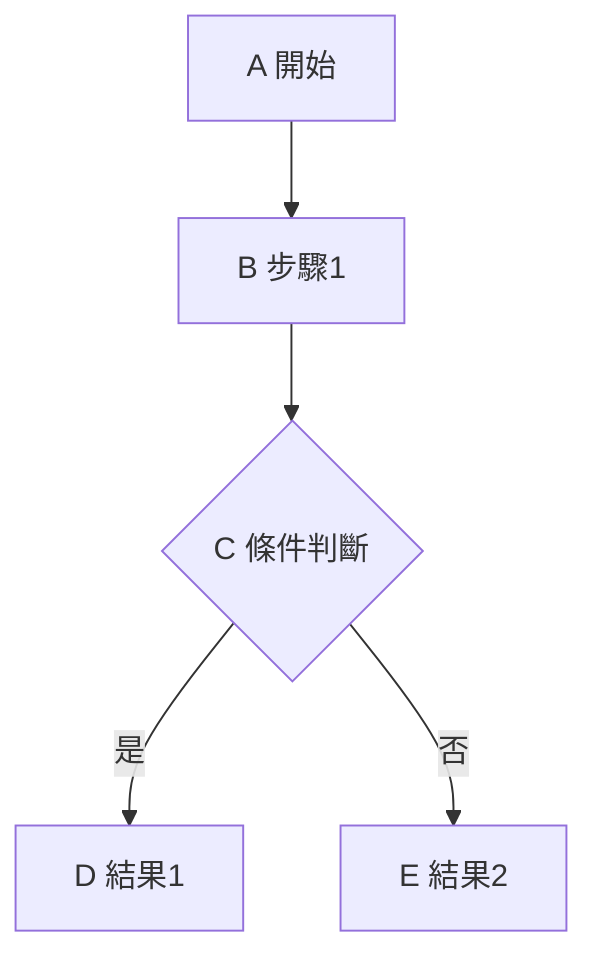
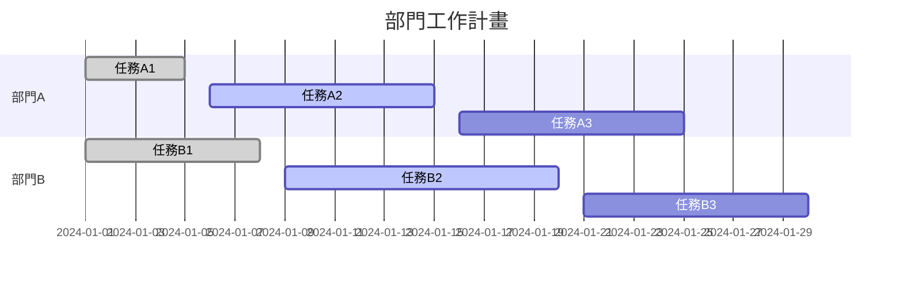
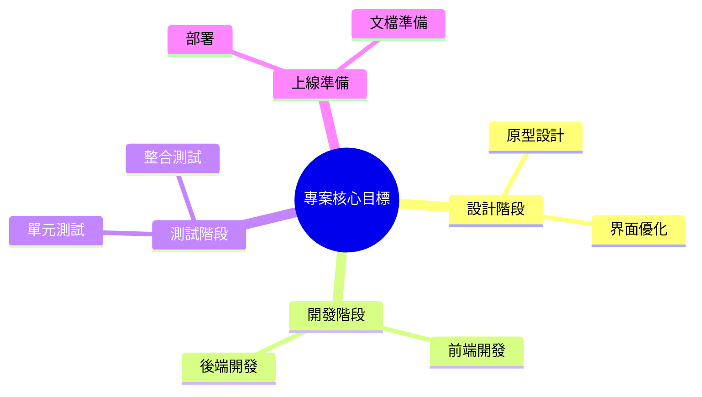

# 🤖 生成式 AI 與提示工程


## 評分佔比
- **課程參與及出席 (10%)**：包含四次視訊面授、面授互動、數位教材觀看進度。
- **平時作業 (20%)**：第一次與第二次作業各佔 10%。
- **期中報告 (30%)**：評分標準為情境敘述完整性、創新度、豐富度。
- **期末報告 (40%)**：評分標準為提示工程演練結果與框架對應說明。

## 重要期限
- **作業繳交截止**：2026/05/22 (五) 23:59:59
- **期中/期末報告上傳截止**：2026/06/05 (五) 23:59:59
- **數位教材觀看統計截止**：2026/06/05 (五) 23:59:59

## 核心規定
- **補救措施**：
    - 面授缺席：需請假並於兩週內繳交心得報告，分數以 80% 計算。
    - 逾期繳交（作業/報告）：一週內可補交，分數以 80% 計算。
- **報告要求**：設定日常應用情境，運用提示工程由 ChatGPT 生成內容並調整至最佳結果。

# 作業詳細內容

### 作業一：GAI 議題討論 (10%)

- **階段一 (115/03/27 前)**：於數位學習平台討論板發表一則生成式 AI 相關議題，標題需以 `[GAI 議題]` 開頭。[[SageTower/generative-ai-prompting homeWork1|作業一：GAI 議題討論]]
- **階段二 (115/04/12 前)**：回應至少一則同學發表的議題，並進行趣味程度評分。
- **最終繳交 (115/05/22 前)**：將上述流程截圖並填寫於「作業一填答卷」後上傳至平台。

### 作業二：提示工程演練 (10%)

- **階段一 (115/04/24 前)**：於討論板發表一則提示工程應用情境演練結果與心得，標題需以 `[提示工程演練]` 開頭。[[SageTower/generative-ai-prompting homeWork2|作業二：提示工程演練]]
- **階段二 (115/05/10 前)**：回應至少一則同學的演練結果，並填寫收穫評分。
- **最終繳交 (115/05/22 前)**：將上述流程截圖並填寫於「作業二填答卷」後上傳至平台。

#  AI 基礎概念

- **人工智慧 (AI, Artificial Intelligence)**：廣義的學科，目標是讓機器模擬人類智能。
    - _範例：深藍（Deep Blue）西洋棋程式。_
- **判別式人工智慧 (DAI, Discriminative Artificial Intelligence)**：重點在於從數據中學習規律，進行分類或預測。
    - **機器學習 (ML)**：AI 的子集，從數據中自動學習。_範例：垃圾郵件自動過濾。_
        - **深度學習 (DL)**：ML 的子集，利用多層神經網路處理複雜模式。_範例：手機的人臉辨識解鎖。_
- **生成式人工智慧 (GAI, Generative Artificial Intelligence)**：深度學習的最前沿應用，能創造出全新的內容。
    - 範例：使用 ChatGPT 撰寫報告或用 Midjourney 生成圖片。

### 判別式AI VS 生成式AI
- **判別式人工智慧 (DAI, Discriminative Artificial Intelligence)**：核心為「分類與判斷」。
    - **目標**：進行資料標記（例如：辨識這張圖是貓還是狗）。
    - **關鍵概念**：特徵提取與分類，擅長處理「選擇題」。
    - **應用場景**：垃圾郵件過濾、人臉辨識、股市預測、推薦系統。
- **生成式人工智慧 (GAI, Generative Artificial Intelligence)**：核心為「創造與建模」。
    - **目標**：理解組成結構，進而「畫出」或「創造」全新內容。
    - **關鍵概念**：內容分佈 (Distribution)，擅長處理「申論題」。
    - **應用場景**：ChatGPT (文本)、Midjourney (影像)、Suno (音樂)。

### 生成式AI基本觀念

- **概率預測 (Next Token Prediction)**：GenAI 並非真正思考，而是依據統計機率預測下一個字或像素，這也是產生「幻覺」（一本正經地胡說八道）的原因。
- **潛在空間 (Latent Space)**：一個抽象的高維空間，將萬物轉化為座標 (Embedding)。提示工程的本質就是引導 AI 在此空間中找到我們想要的那個「點」。
- **從「確定性」到「機率性」 (Deterministic vs. Probabilistic)**：
    - 傳統軟體：確定性，輸入 A 必得到 B。
    - GenAI：機率性，同樣的輸入可能得到不同的結果。
- 提示工程：核心作用在於「穩定輸出」，減少不確定性。

### ChatGPT 使用用途統計

根據 API 提示詞數據集統計，使用用途分佈如下：
1. **生成 (Generation)**：45.6%
2. **開放式問答 (Open QA)**：12.4%
3. **腦力激盪 (Brainstorming)**：11.2%
4. **聊天 (Chat)**：8.4%
5. **改寫 (Rewrite)**：6.6%
6. **摘要 (Summarization)**：4.2%
7. **分類 (Classification)**：3.5%
8. **其他 (Other)**：3.5%
9. **封閉式問答 (Closed QA)**：2.6%
10. **擷取 (Extract)**：1.9%

### 人工智慧發展四階段

- **第一階段 (1950-1960) 符號邏輯**：把人類思考邏輯放進電腦。
    - _範例：西洋棋程式、邏輯證明器。_
- **第二階段 (1980-1990) 專家系統**：把人類知識規則放進電腦。
    - _範例：MYCIN 醫療診斷系統、法律諮詢系統。_
- **第三階段 (2010-2022) 機器學習**：把人類所有看見放進電腦。
    - _範例：AlphaGo、人臉辨識、推薦演算法（如 Netflix 推薦）。_
- **第四階段 (2022-Present) 生成創造**：把人類認知創意放進電腦。
    - _範例：ChatGPT、Midjourney、Suno。_

### 自然語言處理 (NLP) vs 大語言模型 (LLM)

- **NLP (Natural Language Processing) ——「領域與學科」**
    - **定義**：人工智慧與語言學的交集，目標是讓電腦「理解、分析、生成」人類語言。
    - **傳統做法**：注重語法規則，如詞性標註、斷詞、情感分析。
    - **局限性**：屬於「專才」，一個模型通常只能執行單一任務（如翻譯機器人無法寫詩）。
- **LLM (Large Language Model) ——「強大的工具與引擎」**
    - **定義**：NLP 領域在深度學習階段的產物，利用海量數據訓練出的巨型模型。
    - **核心特質**：規模極大（數千億參數、全互聯網文本），從專才進化為「全才」。
    - **運作原理**：基於機率預測下一個字（例如：台灣最高的山  玉  山）。

#### 關鍵技術：Transformer

- **定義**：這是現代 LLM 的核心架構（如 GPT 中的 "T"），取代了早期的 RNN/CNN。
    - **RNN (Recurrent Neural Network, 循環神經網路)**：
        - **原理**：按順序逐字處理資訊，像是在讀書，具有時間序列的「記憶」。
        - **局限**：難以處理長文本（容易遺忘前面的資訊），且無法平行運算（速度慢）。
        - **範例**：早期的語音助理、簡單的翻譯軟體。
    - **CNN (Convolutional Neural Network, 卷積神經網路)**：
        - **原理**：透過過濾器捕捉局部特徵（如線條、形狀）。
        - **局限**：主要針對局部區域，難以理解整段文字的全局關聯。
        - **範例**：影像辨識（貓狗分類）、掃描文字辨識 (OCR)。
- **核心機制——注意力機制 (Attention)**：讓模型在處理長句子時，能同時「注意」到所有相關的字詞，解決了 RNN 遺忘與 CNN 局部限制的問題。

### 什麼是生成式AI

- **生成式人工智慧 (GAI, Generative Artificial Intelligence)**：深度學習的最前沿應用，能創造出全新的內容。
    - **定義**：透過學習大量現有資料，建立特定的模式與結構，並模仿人類創作過程，生成符合特定需求的全新內容。
    - **輸入與輸出**：
        - **輸入**：文字、圖像、聲音等數據。
        - **輸出**：新生成的內容，如文章、圖像、音樂。
    - 範例：使用 ChatGPT 撰寫報告或用 Midjourney 生成圖片。

### 生成式AI核心技術

- **生成對抗網路 (GANs)**：以生成器與辨別器進行「對抗訓練」，逐漸產生接近真實的數據。
- **變分自編碼器 (VAEs)**：將數據「編碼」後，依據特徵組合重新「解碼」，產生接近真實的數據。
- **自迴歸模型 (AR Model)**：生成第一步後，依據先前的結果，「一步一步」預測與生成數據的每個部分。

### 生成式 AI 技術進展里程碑

- **2014**：GAN（生成對抗網路）的提出，進入 AI 新世代。
- **2015**：Open AI 創立，開始研發 GPT 模型。
- **2017**：Transformer 問世，帶來 NLP 革命。
- **2020**：GPT-3 推出，生成式 AI 應用開始爆發。
- **2022**：GPT-3.5 推出，對話系統 ChatGPT 問世。
- **2023**：GPT-4 推出，運用大型多模態技術，打破語言模型限制。

### 重大產業變革：關鍵技術的發明

|時間|內容|工業革命|
|:--|:--|:--|
|16 世紀|印刷術|-|
|18 世紀|蒸氣機、機械、生產工廠|第一次工業革命|
|19 世紀中|鋼製汽船、鐵路、內燃機|第二次工業革命|
|19 世紀末|汽車、電力、電話、飛行器|第二次工業革命|
|20 世紀|核能技術、自動化、精密製造、電腦、網路|第三次工業革命|
|21 世紀|生物科技、奈米科技、物聯網、人工智慧|第四次工業革命|

### 現代應用的廣泛化
- **圖像生成**：MidJourney、DALL-E
- **自然語言**：ChatGPT、翻譯、內容生成
- **音樂與影片創作**：AI 編曲、影片特效、Sora

# 大語言模型介紹

- **Large Language Model (LLM)**：指利用大量數據訓練出來的超大型語言模型。
- **Transformer**：是目前主流 LLM（如 GPT 系列）的**核心內部架構**。
- **Attention is All you Need**：這篇 **2017 年的論文**提出了 Transformer 架構，是現代 LLM 發展的關鍵基礎。

### 大語言模型為文字生成接龍器 (Token Prediction)

提示詞 (prompt) -> 要從哪裡預測的開端

此流程展示了 LLM 如何依序預測下一個 Token（單字或詞彙片段）：

1. **輸入 (Prompt)**：`台灣最大的半導體公司?`
    - **LLM 預測**  **Token**：`台灣`
2. **輸入 (累積)**：`台灣最大的半導體公司?台灣`
    - **LLM 預測**  **Token**：`積體電路`
3. **輸入 (累積)**：`台灣最大的半導體公司?台灣積體電路`
    - **LLM 預測**  **Token**：`製造`
4. **輸入 (累積)**：`台灣最大的半導體公司?台灣積體電路製造`
    - **LLM 預測**  **Token**：`股份`
5. **輸入 (累積)**：`台灣最大的半導體公司?台灣積體電路製造股份`
    - **LLM 預測**  **Token**：`有限公司`
6. **輸入 (累積)**：`台灣最大的半導體公司?台灣積體電路製造股份有限公司`
    - **LLM 預測**  **Token**：`[END]` (生成結束)

**邏輯總結：** LLM 每次預測一個 Token，並將新預測的 Token 接續到原有的輸入序列後，作為下一次預測的上下文（Context）。此過程持續進行，直到模型生成結束標記 `[END]`。

### Token 概念與處理流程

- **Token**：LLM 處理文本的最基本單位。

**流程說明：**

1. **使用者輸入 (Prompt)**：使用者輸入文本，例如：
    - `台灣最大的半導體公司?` (查詢輸入)
    - `台灣積體電路製造股份有限公司` (生成輸出)
2. **編碼 (Tokenizer)**：輸入的文本會被轉換成 LLM 可以理解的數值序列（Token ID）。
    - `台灣最大的半導體公司?`  `[98, 79, 78, 20, 13]` (此為範例 Token ID)
3. **LLM 處理**：LLM 接收數值序列並進行計算。
4. **解碼 (Decoding)**：LLM 輸出的數值序列會被轉回人類可讀的文本。
    - `[27, 45, 40, 21, 11]`  `台灣積體電路製造股份有限公司` (此為範例 Token ID)


### 什麼是上下文 (Context)

上下文 (Context) 是 LLM 進行連貫對話和執行特定任務的關鍵機制，它決定了模型如何解釋當前的輸入並生成回應。

**情境範例：**

- **對話歷史 (Chat History)**：
    - `USER: 您好，我叫紹弘`
    - `LLM: 您好，紹弘`
- **USER 問題 (Current Query)**：
    - `我的名字叫做什麼？`
- **LLM 處理**：LLM 會將「對話歷史」與「當前問題」合併，形成完整的上下文輸入。
- **當前回答 (Response)**：
    - `你->叫->紹弘`

**核心概念：** LLM 並非像人類一樣擁有長期記憶。每次對話時，系統會將**先前完整的對話記錄**（或其摘要）與**當前輸入**一起作為新的 Prompt 傳入模型。這確保了模型能「記得」之前的資訊，從而產生連貫的對話。


### Markdown 語法

- 一種輕量級標記語言
- 讓文字進行格式化，並轉換成其他格式
- 廣泛應用於撰寫技術文檔、筆記等

### 語法比較

|特性|程式語言|HTML|文字檔|Markdown|
|:--|:--|:--|:--|:--|
|易讀性|較低|中等|高|高|
|學習難度|高|中|無需學習|低|
|排版能力|高|高|無|中等|
|可攜性|中等|中等|高|高|


### Markdown 語法簡介

- **標題**：使用 `#` 表示標題，`#` 的數量代表標題層級 (1-6級)
- **段落**：段落之間需留一個空行來分隔
- **列表**：無序列表：用 `-`、`*` 或 `+` 開頭
- **連結**：`[顯示文字](https://example.com)`  
    ``

### 字體樣式

- **粗體**：使用 `**` 或 `__` 包裹文字：`**這是粗體文字**`
- **斜體**：使用 `*` 或 `_` 包裹文字：`*這是斜體文字*`
- **刪除線**：使用 `~~` 包裹文字：`~~這是刪除線文字~~`

### 工具介紹

該如何選擇 Markdown 工具？
- **Mark Text**：適合快速和簡單的文檔創建，具有所見即所得的界面。
- **VS Code + 插件**：最適合技術性和複雜的文檔，具有廣泛的插件支持。
- **GitHub**：適合具有版本控制和預覽功能的協作項目。

### Visual Studio Code (VS Code)

- 免費且輕量的程式開發工具
- 支持多種程式語言
- 提供完整程式除錯測試功能
- 跨平台使用 (Windows, Linux, macOS)
- 後續擴充支援度高

### 安裝 VS Code

官方網站：`https://code.visualstudio.com/`

### 安裝插件圖示

- **Markdown All in One**：  
    提供基本語法標示、快捷鍵支持和自動完成功能
- **Markdown Preview Enhanced**：  
    支持即時預覽，並能匯出 PDF 和 HTML
- **Mermaid Markdown Syntax Highlighting**：  
    支持 Mermaid 圖表語法的渲染和強調呈現

### 建立檔案

#### 建立新文件：

- 點擊左上角「檔案 (File)」  「新建檔案 (New File)」
- 命名文件為 `example.md`，並儲存到工作區資料夾中
- `.md` 是 Markdown 文件的標準格式

#### 製作專案流程清單：

學習 Markdown 的基本語法，製作簡單的專案流程清單。  
使用語法：標題、段落、列表。

**`example.md` 內容範例：**

```markdown
# 專案流程
**1. 需求收集**
- 與客戶討論需求。
- 撰寫需求文檔。
**2. 設計階段**
- 原型設計。
- 界面設計。
```

### 基礎語法演示：清單 (不使用 Mermaid)

- **一級標題**：使用 `#` 定義標題
- **有序清單**：使用 數字和點號定義
- **無序清單**：使用 `-` 或 `*` 定義
- **多層次結構**：在子項目前添加 4 個 空格 (縮排一次)

### 輸出Markdown文件

1. 點擊右下角三條線設定
2. 點擊 Export，選擇要輸出的格式 (例如：PDF)


<smtcmp_block language="markdown">
## 什麼是Mermaid ?

Mermaid.js 是一個開源的 JavaScript 圖表繪製庫。

*   **簡單語法** $\rightarrow$ 多種圖表類型
*   **Markdown 集成** ($\downarrow M\downarrow$) $\leftarrow$ VS Code 兼容性 ($\infty$)

### Mermaid 場景應用實作
- 流程圖
- 甘特圖
- 思維導圖

### 應用場景 1 - 流程圖
用途：展示過程和條件分支的決策邏輯

**Mermaid 語法解析：**
- ```mermaid 和最後的 ``` 是 Mermaid 生成圖表的語法
- `flowchart TD`：流程圖方向 (Top Down, 從上到下)
- 方框 `[]` 表示步驟, 菱形 `{}` 表示條件判斷

**語法範例 (`exampleB.md`):**
``` 
flowchart TD
A["A 開始"] --> B["B 步驟1"]
B --> C{"C 條件判斷"}
C -->|是| D["D 結果1"]
C -->|否| E["E 結果2"]
```


### **樣式定義屬性：**

- **fill**: 背景顏色
- **stroke**: 邊框顏色
- **stroke-width**: 邊框粗度
- **weight**: 格子寬度
- **height**: 格子高度
- **classDef**: 定義樣式以套用多個物件

**箭頭樣式屬性：**

- **stroke**: 箭頭線條顏色
- **stroke-width**: 箭頭線條寬度
- **linkStyle [數字]**: 指定該箭頭樣式 (索引從 0 開始)
- **linkStyle default**: 預設箭頭樣式

### **樣式設定範例：**
```
%% 格子樣式設定
style A fill:lightblue,stroke:darkblue,stroke-width:2px
style C fill:white,stroke:#333,stroke-width:2px

%% Class 樣式設定
classDef StyleBox fill:lightpurple,stroke:Wisteria,stroke-width:2px
class B,D,E StyleBox

%% 箭頭樣式設定
linkStyle 0 stroke:orange,stroke-width:2px
linkStyle default stroke:green,stroke-width:2px
```


### 應用場景 2 - 甘特圖

用途：展示項目階段和時間計劃

**語法解析：**

- `title`: 甘特圖的標題
- `section`: 階段分區
- 每個任務包括：狀態 (`done`, `active`)、代碼、時間範圍

**甘特圖語法範例：**




### 應用場景 3 - 思維導圖 (心智圖)

用途：結構化展示專案目標及子目標

**思維導圖語法範例：**



# 提示工程

### 什麼是提示詞 (Prompt)?

- **關鍵輸入**：與生成式 AI 互動的媒介，用於引導 AI 的回應。
- **影響精確度**：提示詞的品質直接影響生成內容的準確性。
- **引導結果**：藉由設計合理的提示詞，獲得更符合預期的生成結果。

### 範例：電子郵件回信擬稿

**輸入提示詞：**

> 有新客戶來信詢問，請幫我寫一份感謝對方的電子郵件。

**AI 生成結果：**

- **主旨**：感謝您的來信
- **內容摘要**：
    - 感謝對公司/產品表現興趣。
    - 表明非常高興有機會提供協助。
    - 邀請客戶提供更多需求細節以便後續安排。
    - 包含簽署檔欄位（姓名、職稱、公司名稱、聯絡方式）。

### 口語直接提問的缺點

- 背景狀況沒辦法描述清楚
- 目標過於抽象
- 條件模糊沒有重點
- 無指定輸出結果
- 需反覆提問才逐漸聚焦

### 深津氏泛用 Prompt (深津氏提問框架)

1. **清楚定義角色**：賦予 AI 專家身份。
2. **明確指示輸入輸出**：規定輸入什麼、獲得什麼。
3. **清楚說明輸出內容**：描述輸出應包含的具體要素。
4. **使用標記式語言來說明**：利用 Markdown 等標籤結構化資訊。
5. **以條列式給予指令**：邏輯清晰，降低理解錯誤。
6. **限縮 AI 回答範圍**：防止發散，聚焦於核心目標。

### 提示詞分類與範例

- **描述性提示詞**：提供詳細描述，引導 AI 生成特定內容。
    - _範例： 「描述一個晴朗夏日的沙灘景象」_
- **限制性提示詞**：設定約束條件，讓生成結果符合特定要求。
    - _範例：「生成一篇不超過 100 字的產品描述」_
- **創意性提示詞**：激發 AI 的創意，生成有趣或新穎的內容。
    - _範例：「寫一個關於外星人與人類合作解救地球的故事」_

### 提升生成內容的結構性

- **標題的應用**：讓 AI 使用標題來分隔不同主題。
- **列表的應用**：請 AI 使用列表來組織資訊。
- **程式碼區塊的應用**：用於生成技術性內容或特定格式的輸出。

**指令範例：**

> 用繁體中文生成一個含有標題、列表、程式碼區塊的「Java 語言：Hello World 程式」簡單介紹及教學。

### 實際應用範例

#### 範例一：結構化感謝郵件 (Markdown 結構化輸入)

```markdown
# 撰寫一份感謝郵件
- 新顧客來信的回信
- 請依據下列的 [目標] 跟 [要點] 撰寫感謝郵件，並符合 [文章風格] 的設定

## [目標]
- 成功得到商談機會

## [要點]
- 先提出感謝
- 再提出邀約
- 強調在商談的時候，可說明最新發展趨勢與潛在商機

## [文章風格]
- 商業信件
- 正式
- 有禮貌
```

#### 範例二：會議記錄整理 (框架式定義)

- **角色**：你是一位專業行政助理，擅長快速整理會議紀錄並提煉重點。
- **背景**：你剛參加完部門會議，需要撰寫會議紀錄供主管與同仁參考。
- **任務**：撰寫一份清晰的會議紀錄，包含討論重點、決議事項及後續行動計畫。
- **格式**：以條列式呈現會議重點，分為「討論內容」、「決議事項」及「待辦事項」。
- **語氣**：正式、精煉，方便快速閱讀與追蹤進度。

