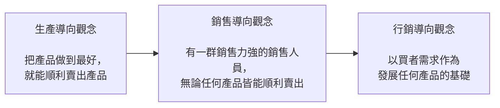

## 作業撰寫格式參考:
壹、XXXX
  一、VVVV
    （一）MMMM
      1. AAAA
        （1）DDDD

例如:
一、AAAAA...？BBBBB....？CCCCC....？
答：XXXXXX...
  （一）AAAAA...
    1. SSSS
      （1）MM
      （2）NN
    2. SSSS
      （1）MM
      （2）NN
  （二）BBBBB...
    1. SSSS
      （1）MM

## 第一章 行銷在經濟社會中所扮演的角色與本書大綱

### 前言

* 行銷對公司與機構的涵義與功能，及其在人類社會經濟活動上所扮演的角色，遠超過一般人認知的。
* 歐德生是第一個將行銷觀念從公司機構提升到整體社會層次的學者，他認為行銷在整個經濟社會中占有相當重要的位置。
* 寇特勒與貝構吉將行銷定義為解決交換的問題，而交換的問題包括：
  * 為什麼組織與個人需要交換關係。
  * 交換關係是如何產生、解決、甚至避免的。

### 交換的問題

* 買賣雙方對於他們所要買賣的標的物在交換之前與之後，都能賦予非常清楚的說明與審核，同時在交易的過程中也都沒有欺騙的行為，那麼買賣雙方的交換過程就會變得非常有效率。
* 但問題是，在現今的經濟社會中，因為產品的複雜度與產品說明的不透明化，經常導致買賣雙方在交換之前無法完全清楚地瞭解對方所要提供的產品；甚至在交換之後，也沒有辦法清楚地審核、監視對方是否依約提供產品。
* 交換的問題為阻礙經濟活動效率的一大主因，而經濟社會的交換無法順利完成，連帶地，也使得廠商無法有效率地與買者進行交換（如圖1-1）。
* 行銷的功能可以在一個供給與需求資訊都非常複雜的情況下，幫助買賣雙方做到最適當的撮合，因而達到貨暢其流。
* 如果這個社會沒有了廣告與行銷工具，買者在選購產品上一定會更為耗時。而當買賣雙方交換的問題無法被很有效地處理時，整個社會的存貨一定會大量增加。
* 行銷所處理的問題並不只限於公司的層次，而應該擴大至整個經濟社會，唯有如此，才能瞭解行銷真正的範圍與精神。

### 交換 vs. 交易

* 行銷處理的重點是在交換而非交易。
* 交換的英文是 exchange，而交易的英文則為 transaction，在交換的過程中不一定會牽扯到金錢，但在交易的過程中一定會牽扯到金錢。
* 大部分的行銷學者都認為行銷的觀念應該可以被廣泛地運用，而交換的標的物並不只限於產品、服務與金錢，也有可能是其他無形或有形的東西。

### 交換的當事人種類

* 交換的當事人種類
  * 廠商與消費者 (B to C / C to B)
  * 企業與企業 (B to B)
  * 消費者與消費者 (C to C)
* 最常見的交換關係可分為下列幾種：
  * 第一種為廠商與消費者間的交換
  * 第二種為廠商與通路商間的交換
  * 第三種為廠商與供應商間的交換
  * 第四種為通路商與零售商間的交換
  * 第五種為零售商與消費者間的交換

### 行銷如何促進交換的完成

* 行銷時期強調在所有的交換行為中，都應該要去思考另一方的需求為何。如果我們可以事前瞭解買者的需求，就能夠把產品設計、包裝成對方所希望的形式，如此一來，在產品推出後，便可順利獲得買者的青睞（如圖1-3）。
* 行銷所強調的一個重要基礎，就是行銷的程序中有關產品發展、行銷定位、產品、定價、通路與促銷廣告策略等活動，都是以買者的需求為出發點，並企圖使買者達到最大的滿足。

#### 圖1-3 生產、銷售與行銷導向觀念

### 4P與行銷的關係

* 所謂的4P是指行銷組合中的產品 (Product)、定價 (Price)、通路 (Place)、推廣 (Promotion) 四大部分。
* 4P是行銷的四個工具，它們主要是用來幫助執行行銷策略，促進交換的完成。
* 隨著時代的改變，過去符合買者規格的產品，現在不一定能契合其需求，行銷人員的主要任務是分析買賣雙方的交換問題到底是什麼，並透過4P工具，讓交換更有效率（如圖1-4）。
* 不論有幾個P，如果我們要更靈活地運用行銷，就不應該受限於4P，若能想到更好的行銷方式，即使不在4P的範圍內，只要能促進交換行為更有效率地完成，就是行銷人員可以利用的工具。

### 行銷能力的培養

* 行銷人員在制定任何行銷策略之前，必須先清楚知道公司目前的市場現況 (What)，進而分析造成市場現況的可能原因 (Why)，才能真正選擇適當的行銷工具 (4P) 來改善經營現況 (How)。
* 行銷交換的問題原因是可以被適當歸類分析的，只要透過適當的 What & Why 因果關係訓練，學習者可以更清楚地抓住行銷的根本問題。
* 透過問題因果分析才能正確排序，執行最重要與最及時的行銷工具（如圖1-5）。

### 交換是長期的活動

* 行銷學的問題重點已從早期發掘單次交換行為形成的原因，逐漸延伸至探討如何與買者建立長期關係的關係行銷上，也就是研究如何增加買者滿意度、建立與買者的良好關係、取得買者的信任及承諾，進而提高買者的忠誠度（如圖1-6）。
* 除非公司所面對的市場是個全新的產業，業務的主要來源是來自新客戶的營業額，否則其行銷的問題就不是在前面的區隔與定位、找到最適當的客戶，而是在交換之後，如何使與客戶間的關係永續存在。而要讓廠商與客戶間的關係永續存在，關係行銷或是形成合作夥伴的關係會是可行的方法之一。
* 市場需求導向的觀念
  * 透過市場需求導向的觀念去影響公司策略、技術能力的發展，以及核心能力的建立。

### 動態 vs. 靜態的行銷

* 靜態的行銷規劃方式越來越難跟得上市場變化的腳步。
* 新媒體、新通路和新行銷科技的應用讓商品行銷的樣貌，從固定變成動態，行銷的過程已逐步從單方向推廣產品，演變成與顧客雙向互動的行銷方式。
* 以 LINE 為例，第一階段主要是燒錢提供免費產品服務來吸引顧客加入，第二階段再開始從供應商和廣告主的角度來思考，當有越來越多的供應商和廣告主進入到這個平台，整個平台也越來越豐富，進而能夠吸引更多顧客願意加入，形成良性的循環，讓這個平台越來越茁壯。這樣的行銷方式已經是未來行銷的標準。

### 被誤解的行銷功能

* 第一個最常見的誤解是些超額利潤是透過行銷包裝所產生的效果，行銷主要目的就是把一個產品加上行銷包裝，以達到提高價格的目的。
* 第二種對行銷的誤解，是認為消費者買東西不會完全理性，所以廠商可以透過廣告和促銷活動來迷惑消費者，騙他們來購買產品。
* 一個品牌如果只會透過廣告和活動來塑造一些不是這個品牌所追求的理念，消費者對這個品牌的觀感也會受影響，甚至可能懷疑這個品牌是否願意堅持原有理念，長期而言對這個品牌是相當危險的。

## 第二章 策略行銷分析的理論架構

### 前言

* 買者持續使用某一品牌產品的原因
  * 滿意此品牌所提供的產品。
  * 不想花太多的時間再去蒐集相關產品的其他資訊。
  * 已經習慣了，或是因為已經投入了一些有形、無形的資產。
* 如果行銷人員希望買者能夠放棄他們原來使用的品牌而來嘗試其所提供的產品時，他就必須思考如何解決買者所擔心的這些問題。事實上，這就是典型的「交換的問題」，而行銷就可以解決這種交換的問題。

### 本書架構的理論基礎

* 社會學家布羅 (Peter M. Blau) 的結構交換理論
  * 交換的產生乃源自於交換雙方期待該交換行為對自己是有利的。
* 交換成本包含
  * 逆選擇 (Adverse Selection)
  * 道德危機 (Moral Hazard)
  * 專屬資產 (Asset Specifity)
* 逆選擇
  * 因為實際交易前，買賣雙方的資訊不對稱，買方必須花時間與其他成本來搜尋賣方的相關交易資訊，以縮減資訊不對稱。

### 阻礙「交換」的四個主要成本

* 買者在購買產品或服務時，主要考慮四大因素：
  * 成本效益的問題
  * 資訊搜尋成本
  * 是否信任賣方的成本
  * 有形或無形的轉換成本

### 四個成本的定義與說明

* 外顯單位效益成本 (C1)
* 買者資訊搜尋成本 (C2)
* 買者道德危機成本 (C3)
* 買者專屬陷入成本 (C4)

### 外顯與內隱成本的分類

* 一個產品的外顯單位效益成本越低，在市場上的競爭力就越強；相反地，如果外顯單位效益成本越高，則在市場上的競爭力就越低。
* 表面上看來，一家公司的產品只要在外顯單位效益成本上有競爭優勢，那麼該產品被買者採用的機率應該會是非常高的。不過，從一些實務的例子發現，很多產品的外顯單位效益成本雖然比競爭對手更具優勢，卻不一定會受到買者的青睞。
* 買者要不要採用一項產品的決定是包括外顯單位效益成本與內隱交換成本的總和，而不是只有單獨考量外顯單位效益成本或內隱交換成本就做決定。

### 行銷交換效率公式

$$行銷交換效率 = F(Cost_{c/u}, Cost_{is}, Cost_{mh}, Cost_{as})$$

* $Cost_{c/u}$ ：外顯單位效益成本 (Buyer Cost / Buyer Utility)
* $Cost_{is}$ ：資訊搜尋成本 (Information Searching Cost)
* $Cost_{mh}$ ：道德危機成本 (Moral Hazard)
* $Cost_{as}$ ：專屬資產成本 (Asset Specificity)

### 買者知覺最終總成本的觀念

* 交易成本就好像經濟社會中的摩擦阻力，經濟社會中所有的交易、交換並不如大家所想像的那麼平順。
* 買者知覺最終總成本的觀念認為，買者在交換前會知覺並衡量所要支出的外顯單位效益成本加上內隱交換成本，以最終總成本的高低來決定此次的交易是否值得進行。
* 每一位買者所知覺到的成本並不一定都相同，而這也絕對不是行銷廠商自己認知的外顯單位效益成本與內隱交換成本。

### 自製或外包

* 由本書所提供的架構並不侷限於買者一定得對外購買，如果買者可以自己製造生產，而其自製的最終總成本又比向外購買來得低，他就有可能會自己製造。
* 有些廠商在分析了外顯單位效益成本與內隱交換成本後，可能會發現這個產品應該要自製而不是外包，因為有時候自製的最終總成本反而較具競爭力（如圖2-4）。
* 許多廠商自行製造產品的成本在除以效益後根本划不來，但是這家公司還是願意自己做，這當中最大的可能，就是這項產品對他們而言是公司的核心能力，是很重要的資產。
* 有很多台商或是日商的產品喜歡採自製的方式，表面上看來，自製的外顯單位效益成本似乎較不划算，但是，基於對外面廠商的道德危機成本較高，並不足以信任的風險意識成本，所以只好自製。

#### 看圖2-5 課本 p51

### 買者主觀判斷的誤差問題

* 買者的外顯單位效益成本及三個內隱交換成本的高低判斷，完全是來自於買者的主觀判斷。
* 如果公司銷售的產品所面對的買者都是低涉入程度或產品知識能力不足時，那麼本書所提出的理論架構是否就比較沒有用處了呢？針對這個問題，我們可以從幾個方向來回答：
  * 一旦買者發覺被騙，他們就會認定賣方是不可靠的，該賣方的道德危機成本便會因而增加。
  * 賣方所面對的買者並不完全都是涉入程度低或產品知識能力低的人，遲早會有人發現這些不當的銷售把戲，進而對賣方產生不好評價，並口耳相傳。
  * 就算買者都沒有發覺問題，但是或許會有公正單位隨時抽查廠商或產品，一旦有瑕疵，終究難逃被察覺。
  * 另一個更可能的情況是競爭對手會主動挖掘其他的問題。

## 第三章 本書理論架構的特性

### 行銷的管理程序學派

* 大部分的行銷教科書皆以管理程序學派為主，而行銷管理程序學派形成最主要的原因是，早期行銷學界經常必須透過瞭解當時的企業是如何運用行銷工具，以及如何做行銷規劃，以之做為藍圖及研究重點，來界定行銷管理的全貌。
* 透過對公司實務的瞭解，再加上一些實際從事行銷的人所寫下的實務知識，當時的行銷學者漸漸就發展出所謂的「行銷管理程序學派」（如圖3-1）。
* 行銷管理程序學派的重點就在於，將實務界如何做規劃與行銷活動的所有程序，做一個非常詳細的敘述。
* 麥卡席認為，行銷的程序應從環境分析開始，再到市場區隔、目標市場及定位，這個階段我們稱之為「行銷的規劃」，也就是瞭解環境現在與未來的狀況，以此推敲出公司最好的市場區隔方法。

### 管理程序學派的主要步驟

* 大環境分析
* 產業分析
* 買者需求分析
* STP程序
* 選定目標市場
* 定位
* STP與4P

### 大環境分析

* 大環境分析事實上是行銷人員希望透過政治、經濟、科技、文化、社會、法律等環境的分析，來瞭解這些環境的現狀與未來可能轉變的方向。
* 大環境分析希望瞭解：
  * 公司所面對的市場範圍是否有可能擴大或萎縮。
  * 到底有哪些行銷工具會因為環境的變化而受影響。

### 產業分析

* 產業的分析主要是用以瞭解公司所面對的產業的競爭、遠景及威脅。
* 波特(Michael Porter)的五力分析：
  * 同業間的競爭情況。
  * 與上遊廠商的談判能力。
  * 與下遊廠商的談判能力。
  * 潛在的進入者。
  * 替代品分析。
* 除了五力分析，還可以應用個體經濟學或是產業經濟理論，針對產業的不同來選擇最適當的產業分析架構。
* 早期的產業策略學說把「環境」視為固定，因此公司必須要因應環境來發展策略，但波特卻認為可以透過五力的改變，把一個原來不好的產業環境變得比較好。

### 買者需求分析

* 買者需求分析最主要的目的，是在瞭解買方市場的一些需求特性，瞭解他們為什麼需要這些產品、什麼時候用這些產品、怎麼用這些產品、到哪裏買這些產品，還有目前對這些產品感到滿意與不滿意的地方。
* 透過買者需求分析，行銷人員將更能能夠找到一個買者未被滿足的需求，且在做市場區隔、目標市場選定或定位時，也能夠更加清楚哪種新產品能夠符合這些顧客的需求。

### STP程序

* 市場區隔
* 區隔變數
* 區隔變數選取原則
* 市場區隔注意事項

### 區隔變數

* 地理變數：如區域、國家、氣候等。
* 人口變數：如年齡、性別、職業、教育程度、家庭生命週期等。
* 心理變數：如社會階層、生活型態、人格等。
* 行為利益變數：如使用型態、忠誠度、使用量、追求的利益等。

### 區隔變數選取原則

* 市場區隔內的買者需求必須一致外，不同市場區隔間的需求差異度也要越大越好。
* 所要選擇的市場區隔必須夠大。如果市場區隔太小，則會有值得值不值得投入此市場的問題。
* 區隔後的市場區隔必須具可描述性且是可接近性。
* 區隔的市場必須是公司想要且有能力提供服務的市場。

### 市場區隔注意事項

* 有些行銷人員認為區隔變數應該盡量以行為利益變數為主，這樣的區隔效果最好。如果公司不能清楚地描述這兩個區隔間的買者特性有何不同，那麼這個區隔就沒有多大的意義存在。
* 市場區隔應該是寧可大不可小，絕對不要把市場區隔得太小。

### 選定目標市場

* 多目標市場的選擇
* 單一的目標市場
* 無差異化的目標市場選擇

### 定位

* 在定位之前，必須先透過分析整個市場區隔內競爭對手的主要訴求、公司本身的能力是否足以完成它所要定位的該項訴求、公司的技術能力是否能夠達到所追求的目標定位，最後才選定一個產品的定位。
* 原則上，行銷人員應儘量去找尋一個未被滿足的需求，如果公司可以提供有效的產品來滿足此需求，那麼這個定位就是一個相當好的定位。行銷人員可以從買者目前的問題、產品內容、產品可以解決的問題下手。
* 如果公司自認為產品的各方面都比競爭對手來得強，自然可以選擇與競爭對手一致的定位，這是正面競爭的一個方式。

### STP 與 4P

* 4P 為 STP 之後所做的下游工作，在擬定 4P 時，要時時檢視其是否與產品定位相符。
* 4P 是行銷的四個工具，主要用以幫助執行行銷策略、促進交換的完成。
* 在公司的整體行銷策略中，最主要的就是 STP 計畫，唯有整合一致的 4P，才能有效地執行整體行銷策略，如果 4P 計畫相互衝突，則整體行銷策略的執行必定事倍功半。
* 4P 的具體策略內容：
  * **第一個 P (Product)**：產品策略。如何根據定位來發展最適當的產品，以符合目標消費者需求。
  * **第二個 P (Place)**：通路策略。如何選擇最適當的通路來做最適當的鋪貨。
  * **第三個 P (Price)**：價格策略。如何選擇最適當的定價方式，為公司獲取最大的利益。
  * **第四個 P (Promotion)**：推廣策略。非常重要的一種行銷工具。

### 行銷的目的

* 策略行銷分析的架構是要讓學習者知道，當我們在進行傳統行銷規劃時，不應該只是為了規劃而規劃，而是要知道每個規劃和 4P 工具的選擇是如何幫助廠商能夠順利完成市場的交換。
* **各項成本的研究目標**：
  * **外顯單位效益成本**：使行銷人員明白整個行銷規劃的最終目標是要提供顧客一個良好的產品或服務效用。
  * **資訊搜尋成本**：最大目標是使行銷人員去思考，如何以最低的預算讓買者清楚知道公司產品主要的定位與賣點，降低買者為了購買品牌產品所花費的時間及心力（如透過媒體規劃、通路設計、公關與異業聯盟）。
  * **道德危機成本**：讓買方清楚知道公司對品牌的宣示沒有誇大且能信守承諾，建立信心後，道德危機成本會下降。
  * **專屬資產與相容性**：思考新產品是否與現有產品相容，並在設計上設法減少買方的疑慮，避免讓買方感覺購買後會被公司予取予求。

### 為何需要有新的行銷架構

* 過去行銷教科書主要強調行銷程序（環境分析 → 市場分析區隔 → 定位 → 執行 4P），學習者常將其視為必然。但在實務上若不瞭解程序背後的道理與目的，「為了行銷而行銷」是相當危險的。

### 對傳統管理學派行銷架構的補強

* 傳統架構常見的問題：
  * **程序導向**
  * **注重交換前的行銷活動**
  * **缺乏成本觀念的訓練**
  * **缺乏因果關係訓練**
  * **容易見樹不見林**

#### 程序導向的思維

* 傳統管理程序學派提供從環境分析、市場區隔、定位到 4P 的重要程序。
* 本書雖然提供全新架構，但並不否定此程序的重要性，行銷人員仍應熟悉。然而若僅瞭解程序，在從事實務工作時仍會顯得稍嫌不足。

#### 注重交換前的行銷活動

* 傳統管理學派多探討如何找到定位以吸引買者。
* 八〇年代後顧客滿意度受到重視，九〇年代後關係行銷成為重點。但一般教科書對此討論過於籠統，因此需要更詳細的理論架構來分析顧客滿意與建立關係等議題。

#### 缺乏成本觀念的訓練

* 行銷人員常沒成本觀念，僅懂得花錢卻未檢視是否花在刀口上。
* 行銷人員應明確瞭解：產品處於什麼階段？交換問題出在哪裡？錢該花在哪裡才能最有效率地解決消費者的內隱交換成本問題？

#### 缺乏因果關係訓練

* 成功的關鍵在於掌握重點以解決資訊搜尋、道德危機或專屬陷入成本。
* 行銷訓練應讓人員隨時觀察：目前的行銷行為到底是在解決哪一個特定的行銷交換成本問題（外顯單位效益、道德危機、資訊搜尋或專屬陷入成本）？

#### 容易見樹不見林

* 傳統架構包含包羅萬象的定位方式、分類與工具，這些僅是「森林中的樹木」。
* 行銷人員應先從宏觀角度瞭解整個「行銷交換問題」在哪裡，再選擇適當工具來解決問題。

