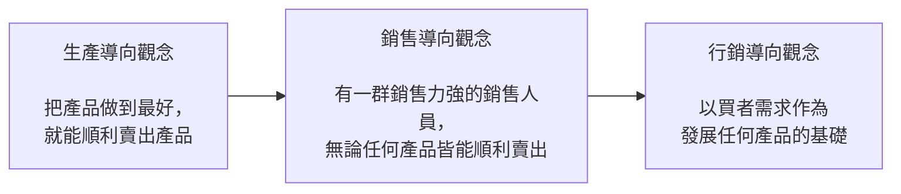

## 作業撰寫格式參考:
壹、XXXX
  一、VVVV
    （一）MMMM
      1. AAAA
        （1）DDDD

例如:
一、AAAAA...？BBBBB....？CCCCC....？
答：XXXXXX...
  （一）AAAAA...
    1. SSSS
      （1）MM
      （2）NN
    2. SSSS
      （1）MM
      （2）NN
  （二）BBBBB...
    1. SSSS
      （1）MM

## 第一章 行銷在經濟社會中所扮演的角色與本書大綱

### 前言

* 行銷對公司與機構的涵義與功能，及其在人類社會經濟活動上所扮演的角色，遠超過一般人認知的。
* 歐德生是第一個將行銷觀念從公司機構提升到整體社會層次的學者，他認為行銷在整個經濟社會中占有相當重要的位置。
* 寇特勒與貝構吉將行銷定義為解決交換的問題，而交換的問題包括：
  * 為什麼組織與個人需要交換關係。
  * 交換關係是如何產生、解決、甚至避免的。

### 交換的問題

* 買賣雙方對於他們所要買賣的標的物在交換之前與之後，都能賦予非常清楚的說明與審核，同時在交易的過程中也都沒有欺騙的行為，那麼買賣雙方的交換過程就會變得非常有效率。
* 但問題是，在現今的經濟社會中，因為產品的複雜度與產品說明的不透明化，經常導致買賣雙方在交換之前無法完全清楚地瞭解對方所要提供的產品；甚至在交換之後，也沒有辦法清楚地審核、監視對方是否依約提供產品。
* 交換的問題為阻礙經濟活動效率的一大主因，而經濟社會的交換無法順利完成，連帶地，也使得廠商無法有效率地與買者進行交換（如圖1-1）。
* 行銷的功能可以在一個供給與需求資訊都非常複雜的情況下，幫助買賣雙方做到最適當的撮合，因而達到貨暢其流。
* 如果這個社會沒有了廣告與行銷工具，買者在選購產品上一定會更為耗時。而當買賣雙方交換的問題無法被很有效地處理時，整個社會的存貨一定會大量增加。
* 行銷所處理的問題並不只限於公司的層次，而應該擴大至整個經濟社會，唯有如此，才能瞭解行銷真正的範圍與精神。

### 交換 vs. 交易

* 行銷處理的重點是在交換而非交易。
* 交換的英文是 exchange，而交易的英文則為 transaction，在交換的過程中不一定會牽扯到金錢，但在交易的過程中一定會牽扯到金錢。
* 大部分的行銷學者都認為行銷的觀念應該可以被廣泛地運用，而交換的標的物並不只限於產品、服務與金錢，也有可能是其他無形或有形的東西。

### 交換的當事人種類

* 交換的當事人種類
  * 廠商與消費者 (B to C / C to B)
  * 企業與企業 (B to B)
  * 消費者與消費者 (C to C)
* 最常見的交換關係可分為下列幾種：
  * 第一種為廠商與消費者間的交換
  * 第二種為廠商與通路商間的交換
  * 第三種為廠商與供應商間的交換
  * 第四種為通路商與零售商間的交換
  * 第五種為零售商與消費者間的交換

### 行銷如何促進交換的完成

* 行銷時期強調在所有的交換行為中，都應該要去思考另一方的需求為何。如果我們可以事前瞭解買者的需求，就能夠把產品設計、包裝成對方所希望的形式，如此一來，在產品推出後，便可順利獲得買者的青睞（如圖1-3）。
* 行銷所強調的一個重要基礎，就是行銷的程序中有關產品發展、行銷定位、產品、定價、通路與促銷廣告策略等活動，都是以買者的需求為出發點，並企圖使買者達到最大的滿足。

#### 圖1-3 生產、銷售與行銷導向觀念

### 4P與行銷的關係

* 所謂的4P是指行銷組合中的產品 (Product)、定價 (Price)、通路 (Place)、推廣 (Promotion) 四大部分。
* 4P是行銷的四個工具，它們主要是用來幫助執行行銷策略，促進交換的完成。
* 隨著時代的改變，過去符合買者規格的產品，現在不一定能契合其需求，行銷人員的主要任務是分析買賣雙方的交換問題到底是什麼，並透過4P工具，讓交換更有效率（如圖1-4）。
* 不論有幾個P，如果我們要更靈活地運用行銷，就不應該受限於4P，若能想到更好的行銷方式，即使不在4P的範圍內，只要能促進交換行為更有效率地完成，就是行銷人員可以利用的工具。

### 行銷能力的培養

* 行銷人員在制定任何行銷策略之前，必須先清楚知道公司目前的市場現況 (What)，進而分析造成市場現況的可能原因 (Why)，才能真正選擇適當的行銷工具 (4P) 來改善經營現況 (How)。
* 行銷交換的問題原因是可以被適當歸類分析的，只要透過適當的 What & Why 因果關係訓練，學習者可以更清楚地抓住行銷的根本問題。
* 透過問題因果分析才能正確排序，執行最重要與最及時的行銷工具（如圖1-5）。

### 交換是長期的活動

* 行銷學的問題重點已從早期發掘單次交換行為形成的原因，逐漸延伸至探討如何與買者建立長期關係的關係行銷上，也就是研究如何增加買者滿意度、建立與買者的良好關係、取得買者的信任及承諾，進而提高買者的忠誠度（如圖1-6）。
* 除非公司所面對的市場是個全新的產業，業務的主要來源是來自新客戶的營業額，否則其行銷的問題就不是在前面的區隔與定位、找到最適當的客戶，而是在交換之後，如何使與客戶間的關係永續存在。而要讓廠商與客戶間的關係永續存在，關係行銷或是形成合作夥伴的關係會是可行的方法之一。
* 市場需求導向的觀念
  * 透過市場需求導向的觀念去影響公司策略、技術能力的發展，以及核心能力的建立。

### 動態 vs. 靜態的行銷

* 靜態的行銷規劃方式越來越難跟得上市場變化的腳步。
* 新媒體、新通路和新行銷科技的應用讓商品行銷的樣貌，從固定變成動態，行銷的過程已逐步從單方向推廣產品，演變成與顧客雙向互動的行銷方式。
* 以 LINE 為例，第一階段主要是燒錢提供免費產品服務來吸引顧客加入，第二階段再開始從供應商和廣告主的角度來思考，當有越來越多的供應商和廣告主進入到這個平台，整個平台也越來越豐富，進而能夠吸引更多顧客願意加入，形成良性的循環，讓這個平台越來越茁壯。這樣的行銷方式已經是未來行銷的標準。

### 被誤解的行銷功能

* 第一個最常見的誤解是些超額利潤是透過行銷包裝所產生的效果，行銷主要目的就是把一個產品加上行銷包裝，以達到提高價格的目的。
* 第二種對行銷的誤解，是認為消費者買東西不會完全理性，所以廠商可以透過廣告和促銷活動來迷惑消費者，騙他們來購買產品。
* 一個品牌如果只會透過廣告和活動來塑造一些不是這個品牌所追求的理念，消費者對這個品牌的觀感也會受影響，甚至可能懷疑這個品牌是否願意堅持原有理念，長期而言對這個品牌是相當危險的。

## 第二章 策略行銷分析的理論架構

### 前言

* 買者持續使用某一品牌產品的原因
  * 滿意此品牌所提供的產品。
  * 不想花太多的時間再去蒐集相關產品的其他資訊。
  * 已經習慣了，或是因為已經投入了一些有形、無形的資產。
* 如果行銷人員希望買者能夠放棄他們原來使用的品牌而來嘗試其所提供的產品時，他就必須思考如何解決買者所擔心的這些問題。事實上，這就是典型的「交換的問題」，而行銷就可以解決這種交換的問題。

### 本書架構的理論基礎

* 社會學家布羅 (Peter M. Blau) 的結構交換理論
  * 交換的產生乃源自於交換雙方期待該交換行為對自己是有利的。
* 交換成本包含
  * 逆選擇 (Adverse Selection)
  * 道德危機 (Moral Hazard)
  * 專屬資產 (Asset Specifity)
* 逆選擇
  * 因為實際交易前，買賣雙方的資訊不對稱，買方必須花時間與其他成本來搜尋賣方的相關交易資訊，以縮減資訊不對稱。

### 阻礙「交換」的四個主要成本

* 買者在購買產品或服務時，主要考慮四大因素：
  * 成本效益的問題
  * 資訊搜尋成本
  * 是否信任賣方的成本
  * 有形或無形的轉換成本

### 四個成本的定義與說明

* 外顯單位效益成本 (C1)
* 買者資訊搜尋成本 (C2)
* 買者道德危機成本 (C3)
* 買者專屬陷入成本 (C4)

### 外顯與內隱成本的分類

* 一個產品的外顯單位效益成本越低，在市場上的競爭力就越強；相反地，如果外顯單位效益成本越高，則在市場上的競爭力就越低。
* 表面上看來，一家公司的產品只要在外顯單位效益成本上有競爭優勢，那麼該產品被買者採用的機率應該會是非常高的。不過，從一些實務的例子發現，很多產品的外顯單位效益成本雖然比競爭對手更具優勢，卻不一定會受到買者的青睞。
* 買者要不要採用一項產品的決定是包括外顯單位效益成本與內隱交換成本的總和，而不是只有單獨考量外顯單位效益成本或內隱交換成本就做決定。

### 行銷交換效率公式

$$行銷交換效率 = F(Cost_{c/u}, Cost_{is}, Cost_{mh}, Cost_{as})$$

* $Cost_{c/u}$ ：外顯單位效益成本 (Buyer Cost / Buyer Utility)
* $Cost_{is}$ ：資訊搜尋成本 (Information Searching Cost)
* $Cost_{mh}$ ：道德危機成本 (Moral Hazard)
* $Cost_{as}$ ：專屬資產成本 (Asset Specificity)

### 買者知覺最終總成本的觀念

* 交易成本就好像經濟社會中的摩擦阻力，經濟社會中所有的交易、交換並不如大家所想像的那麼平順。
* 買者知覺最終總成本的觀念認為，買者在交換前會知覺並衡量所要支出的外顯單位效益成本加上內隱交換成本，以最終總成本的高低來決定此次的交易是否值得進行。
* 每一位買者所知覺到的成本並不一定都相同，而這也絕對不是行銷廠商自己認知的外顯單位效益成本與內隱交換成本。

### 自製或外包

* 由本書所提供的架構並不侷限於買者一定得對外購買，如果買者可以自己製造生產，而其自製的最終總成本又比向外購買來得低，他就有可能會自己製造。
* 有些廠商在分析了外顯單位效益成本與內隱交換成本後，可能會發現這個產品應該要自製而不是外包，因為有時候自製的最終總成本反而較具競爭力（如圖2-4）。
* 許多廠商自行製造產品的成本在除以效益後根本划不來，但是這家公司還是願意自己做，這當中最大的可能，就是這項產品對他們而言是公司的核心能力，是很重要的資產。
* 有很多台商或是日商的產品喜歡採自製的方式，表面上看來，自製的外顯單位效益成本似乎較不划算，但是，基於對外面廠商的道德危機成本較高，並不足以信任的風險意識成本，所以只好自製。

#### 看圖2-5 課本 p51

### 買者主觀判斷的誤差問題

* 買者的外顯單位效益成本及三個內隱交換成本的高低判斷，完全是來自於買者的主觀判斷。
* 如果公司銷售的產品所面對的買者都是低涉入程度或產品知識能力不足時，那麼本書所提出的理論架構是否就比較沒有用處了呢？針對這個問題，我們可以從幾個方向來回答：
  * 一旦買者發覺被騙，他們就會認定賣方是不可靠的，該賣方的道德危機成本便會因而增加。
  * 賣方所面對的買者並不完全都是涉入程度低或產品知識能力低的人，遲早會有人發現這些不當的銷售把戲，進而對賣方產生不好評價，並口耳相傳。
  * 就算買者都沒有發覺問題，但是或許會有公正單位隨時抽查廠商或產品，一旦有瑕疵，終究難逃被察覺。
  * 另一個更可能的情況是競爭對手會主動挖掘其他的問題。

## 第三章 本書理論架構的特性

### 行銷的管理程序學派

* 大部分的行銷教科書皆以管理程序學派為主，而行銷管理程序學派形成最主要的原因是，早期行銷學界經常必須透過瞭解當時的企業是如何運用行銷工具，以及如何做行銷規劃，以之做為藍圖及研究重點，來界定行銷管理的全貌。
* 透過對公司實務的瞭解，再加上一些實際從事行銷的人所寫下的實務知識，當時的行銷學者漸漸就發展出所謂的「行銷管理程序學派」（如圖3-1）。
* 行銷管理程序學派的重點就在於，將實務界如何做規劃與行銷活動的所有程序，做一個非常詳細的敘述。
* 麥卡席認為，行銷的程序應從環境分析開始，再到市場區隔、目標市場及定位，這個階段我們稱之為「行銷的規劃」，也就是瞭解環境現在與未來的狀況，以此推敲出公司最好的市場區隔方法。

### 管理程序學派的主要步驟

* 大環境分析
* 產業分析
* 買者需求分析
* STP程序
* 選定目標市場
* 定位
* STP與4P

### 大環境分析

* 大環境分析事實上是行銷人員希望透過政治、經濟、科技、文化、社會、法律等環境的分析，來瞭解這些環境的現狀與未來可能轉變的方向。
* 大環境分析希望瞭解：
  * 公司所面對的市場範圍是否有可能擴大或萎縮。
  * 到底有哪些行銷工具會因為環境的變化而受影響。

### 產業分析

* 產業的分析主要是用以瞭解公司所面對的產業的競爭、遠景及威脅。
* 波特(Michael Porter)的五力分析：
  * 同業間的競爭情況。
  * 與上遊廠商的談判能力。
  * 與下遊廠商的談判能力。
  * 潛在的進入者。
  * 替代品分析。
* 除了五力分析，還可以應用個體經濟學或是產業經濟理論，針對產業的不同來選擇最適當的產業分析架構。
* 早期的產業策略學說把「環境」視為固定，因此公司必須要因應環境來發展策略，但波特卻認為可以透過五力的改變，把一個原來不好的產業環境變得比較好。

### 買者需求分析

* 買者需求分析最主要的目的，是在瞭解買方市場的一些需求特性，瞭解他們為什麼需要這些產品、什麼時候用這些產品、怎麼用這些產品、到哪裏買這些產品，還有目前對這些產品感到滿意與不滿意的地方。
* 透過買者需求分析，行銷人員將更能能夠找到一個買者未被滿足的需求，且在做市場區隔、目標市場選定或定位時，也能夠更加清楚哪種新產品能夠符合這些顧客的需求。

### STP程序

* 市場區隔
* 區隔變數
* 區隔變數選取原則
* 市場區隔注意事項

### 區隔變數

* 地理變數：如區域、國家、氣候等。
* 人口變數：如年齡、性別、職業、教育程度、家庭生命週期等。
* 心理變數：如社會階層、生活型態、人格等。
* 行為利益變數：如使用型態、忠誠度、使用量、追求的利益等。

### 區隔變數選取原則

* 市場區隔內的買者需求必須一致外，不同市場區隔間的需求差異度也要越大越好。
* 所要選擇的市場區隔必須夠大。如果市場區隔太小，則會有值得值不值得投入此市場的問題。
* 區隔後的市場區隔必須具可描述性且是可接近性。
* 區隔的市場必須是公司想要且有能力提供服務的市場。

### 市場區隔注意事項

* 有些行銷人員認為區隔變數應該盡量以行為利益變數為主，這樣的區隔效果最好。如果公司不能清楚地描述這兩個區隔間的買者特性有何不同，那麼這個區隔就沒有多大的意義存在。
* 市場區隔應該是寧可大不可小，絕對不要把市場區隔得太小。

### 選定目標市場

* 多目標市場的選擇
* 單一的目標市場
* 無差異化的目標市場選擇

### 定位

* 在定位之前，必須先透過分析整個市場區隔內競爭對手的主要訴求、公司本身的能力是否足以完成它所要定位的該項訴求、公司的技術能力是否能夠達到所追求的目標定位，最後才選定一個產品的定位。
* 原則上，行銷人員應儘量去找尋一個未被滿足的需求，如果公司可以提供有效的產品來滿足此需求，那麼這個定位就是一個相當好的定位。行銷人員可以從買者目前的問題、產品內容、產品可以解決的問題下手。
* 如果公司自認為產品的各方面都比競爭對手來得強，自然可以選擇與競爭對手一致的定位，這是正面競爭的一個方式。

### STP 與 4P

* 4P 為 STP 之後所做的下游工作，在擬定 4P 時，要時時檢視其是否與產品定位相符。
* 4P 是行銷的四個工具，主要用以幫助執行行銷策略、促進交換的完成。
* 在公司的整體行銷策略中，最主要的就是 STP 計畫，唯有整合一致的 4P，才能有效地執行整體行銷策略，如果 4P 計畫相互衝突，則整體行銷策略的執行必定事倍功半。
* 4P 的具體策略內容：
  * **第一個 P (Product)**：產品策略。如何根據定位來發展最適當的產品，以符合目標消費者需求。
  * **第二個 P (Place)**：通路策略。如何選擇最適當的通路來做最適當的鋪貨。
  * **第三個 P (Price)**：價格策略。如何選擇最適當的定價方式，為公司獲取最大的利益。
  * **第四個 P (Promotion)**：推廣策略。非常重要的一種行銷工具。

### 行銷的目的

* 策略行銷分析的架構是要讓學習者知道，當我們在進行傳統行銷規劃時，不應該只是為了規劃而規劃，而是要知道每個規劃和 4P 工具的選擇是如何幫助廠商能夠順利完成市場的交換。
* **各項成本的研究目標**：
  * **外顯單位效益成本**：使行銷人員明白整個行銷規劃的最終目標是要提供顧客一個良好的產品或服務效用。
  * **資訊搜尋成本**：最大目標是使行銷人員去思考，如何以最低的預算讓買者清楚知道公司產品主要的定位與賣點，降低買者為了購買品牌產品所花費的時間及心力（如透過媒體規劃、通路設計、公關與異業聯盟）。
  * **道德危機成本**：讓買方清楚知道公司對品牌的宣示沒有誇大且能信守承諾，建立信心後，道德危機成本會下降。
  * **專屬資產與相容性**：思考新產品是否與現有產品相容，並在設計上設法減少買方的疑慮，避免讓買方感覺購買後會被公司予取予求。

### 為何需要有新的行銷架構

* 過去行銷教科書主要強調行銷程序（環境分析 → 市場分析區隔 → 定位 → 執行 4P），學習者常將其視為必然。但在實務上若不瞭解程序背後的道理與目的，「為了行銷而行銷」是相當危險的。

### 對傳統管理學派行銷架構的補強

* 傳統架構常見的問題：
  * **程序導向**
  * **注重交換前的行銷活動**
  * **缺乏成本觀念的訓練**
  * **缺乏因果關係訓練**
  * **容易見樹不見林**

#### 程序導向的思維

* 傳統管理程序學派提供從環境分析、市場區隔、定位到 4P 的重要程序。
* 本書雖然提供全新架構，但並不否定此程序的重要性，行銷人員仍應熟悉。然而若僅瞭解程序，在從事實務工作時仍會顯得稍嫌不足。

#### 注重交換前的行銷活動

* 傳統管理學派多探討如何找到定位以吸引買者。
* 八〇年代後顧客滿意度受到重視，九〇年代後關係行銷成為重點。但一般教科書對此討論過於籠統，因此需要更詳細的理論架構來分析顧客滿意與建立關係等議題。

#### 缺乏成本觀念的訓練

* 行銷人員常沒成本觀念，僅懂得花錢卻未檢視是否花在刀口上。
* 行銷人員應明確瞭解：產品處於什麼階段？交換問題出在哪裡？錢該花在哪裡才能最有效率地解決消費者的內隱交換成本問題？

#### 缺乏因果關係訓練

* 成功的關鍵在於掌握重點以解決資訊搜尋、道德危機或專屬陷入成本。
* 行銷訓練應讓人員隨時觀察：目前的行銷行為到底是在解決哪一個特定的行銷交換成本問題（外顯單位效益、道德危機、資訊搜尋或專屬陷入成本）？

#### 容易見樹不見林

* 傳統架構包含包羅萬象的定位方式、分類與工具，這些僅是「森林中的樹木」。
* 行銷人員應先從宏觀角度瞭解整個「行銷交換問題」在哪裡，再選擇適當工具來解決問題。

# 第四章 管理外顯單位效益成本的行銷策略

### 本章大綱

- 前言
- 外顯單位效益成本優勢的重要性
- 外顯單位效益成本與STP有相當大的關係
- 以外顯單位效益成本的觀念來分析市場區隔
- 如何知道產品的外顯單位效益成本
- 如何降低買者外顯單位效益成本
- 結論

### 前言

- 行銷的工作除了要降低內隱交換成本之外，其實最根本的任務是要創造出一個具競爭力的外顯單位效益成本的產品或服務。
- 若要創造出有價值的產品或服務，行銷部門與產品技術發展部門必須相互密切配合。

### 外顯單位效益成本優勢的重要性

- **定義**：買者取得產品或服務所需支付的總成本除以買者從該產品或服務本身所得到的總效益。
- **降低成本方法**：
    - 增加該產品對目標市場買者的有形效益或無形效益。
    - 減少買者所須支付的產品賣價、運費、安裝費、服務費或手續費等。
- **理論架構價值**：將內隱交換成本從基本成本效益中抽離，能協助行銷人員區分交換問題，並按先後次序處理，使分析更深入。
- **競爭分析策略**：比較競爭力時，應先「真空化」處理（先撇開內隱交換成本），專注於比較產品本身的成本效益，再進一步分析如何解決內隱交換成本。
- **企業重要性**：
    - 公司擁有上市不同外顯單位效益成本之產品的決定權。
    - 外顯單位效益成本是取得競爭力的一大來源。

### 外顯單位效益成本與STP有相當大的關係

- **影響因子**：
    - 買者取得產品所支付的總成本。
    - 在無其他內隱交換成本影響下，消費者所知覺到的總效益。
- **利基市場 (Niche Market)**：指市場中被大企業忽略、需求尚未被完全滿足的特定細分領域。透過透徹瞭解該區隔的特殊需求，公司能在此區隔中提供最符合消費者價值感的產品，進而建立成本效益上的競爭優勢，避免與大品牌進行直接的價格殺戮。
- **行銷決策情境**：
    - **無現成產品時**：先透過環境分析與 STP 制定最佳定位，再依此定位開發產品。
    - **已有既有產品時**：行銷人員需深究產品除基本功能外的附加效用，並審視其最適合的市場區隔，以確保該區隔買者能知覺到最大效用，同時維持合理的營運成本。

### 以外顯單位效益成本的觀念來分析市場區隔

- **分析核心**：透過此觀念，行銷人員能更重視成本效益。
- **市場區隔方式**：
    - **一對一 (one-to-one)**：將每個買者視為獨立區隔，量身設計產品。
    - **大量化行銷 (Mass Marketing)**：將市場視為同質，提供單一產品符合大眾需求。
- **效益評估**：一對一方式效益佳但外顯單位效益成本可能較高；大量化行銷則因效益太低，亦可能導致單位成本偏高。

### 如何知道產品的外顯單位效益成本

- **判斷基礎**：完全源於買者的主觀判斷，業界通常以此為市場競爭力評估的基礎。
- **B to B 市場**：買方需求差異大，業務人員需深入瞭解客戶購買目的及產品能創造的具體價值。
- **研究階段**：
    1. **產品概念階段**：
        - 行銷人員需釐清：產品解決了目標市場什麼問題？產品規格與特性如何解決這些問題？
        - **核心要求**：在無品牌與公司形象加持下，產品之外顯單位效益成本必須優於競品。
        - **消費品策略**：透過抽樣與量化實驗，將產品概念呈現給消費者。
        - **無法撰寫概念的情況**：針對 FMCG（快速消費品）等功能差異不明顯的產品，重點在於心理訴求；可透過預先拍攝簡短廣告或插圖，測試消費者喜好。

#### 實際產品測試階段

- 買者可以看到產品的規格、功能，還可以實際試用看看。若將此時所得到的外顯單位效益成本與其他競爭對手相比，所得的結果將會更加地真實，因為顧客所接觸到的是真實的實體產品或服務。
- 對舊品牌而言，任何產品的更新，最後皆必須整合產品概念、實際產品測試以及品牌名稱的研究，讓顧客在使用新產品時知道是哪一個品牌。

#### 如何降低買者外顯單位效益成本

- 要降低買者的外顯單位效益成本，可以從兩個方向著手：
    - 研究如何降低買者所要付出的成本。
    - 如何提升買者購買產品時的效益。
- 要降低外顯單位效益成本，在降低買者成本方面，最根本的部分還是在於公司的整個生產成本是否可以下降。
- 波特(Michael Porter)認為公司欲維持競爭力，有三種競爭策略可供選擇：
    - **成本化策略(Cost Strategy)**：係指公司在提供其產品服務的過程中，在一定的效用水準下，必須能不斷地降低成本。
    - **差異化策略(Differential Strategy)**：係指公司在一定的成本之下，要能夠不斷地追求顧客所要求的不同效用及利益，在持續差異化的過程中，公司就能在顧客心中建立起獨特的地位。
    - **集中化策略(Focus Strategy)**：集中化策略又包含成本化策略與差異化策略。
- 降低買者外顯單位效益成本的方法（如表4-1）：
    - 降低總生產成本
    - 提升買者效益

#### 降低總生產成本的方法

- **規模經濟與範疇經濟**：
    - 批量增加所產生的單位成本節省的現象，經濟學家稱為規模經濟。
    - 範疇經濟是指不同單位透過共享資源的方式來降低單位成本。
- **熟悉買者的價值鏈態勢**：
    - 如果供應商與買方的價值鏈態勢可以相互配合，進而取得綜效，則買方願意與這家供應商合作的意願必然會提高。
- **生產成本 R & D（研發）能力**：
    - 持續的技術進步，能在滿足顧客所要求的效益的同時，也不斷地降低顧客所要付出的成本。也就是說，擁有高強的 R&D 能力，就可以嘗試著去發展新的技術，以更符合顧客的效益，而顧客所要付出的成本也會因為新的技術而降低很多。
- **生產技術**
- **配銷成本**
- **其他費用的控制**

# 第五章 管理資訊搜尋成本的行銷策略

### 本章大綱

- 前言
- 買者採購決策行為理論
- 推敲可能性理論 (Elaboration Likelihood Model)
- 降低買者資訊搜尋成本
- 數位網路環境下的資訊搜尋成本(C2)策略

### 前言

- 當產品資訊的複雜度越高，則買者所要付出的資訊搜尋成本就會越高，因此行銷人員必須懂得如何有效地減少買者的資訊搜尋成本，以便降低買者的最終總成本。
- 要真正瞭解買者所需付出的資訊搜尋成本，行銷人員必須對買者行為的一些基礎理論有所瞭解，而且若要真正有效地減少買者資訊搜尋成本，行銷人員也必須對目前業界所使用的方法有所認知才行。
- 解決資訊搜尋成本的資訊重點必須與廠商所要傳遞的外顯單位效益成本一致，廠商不可以為了創造推廣效果而強調一些與品牌產品本身的外顯單位效益成本無關的特性。
- **買者所要搜尋的資訊**：
    - 買者必須知道他所要購買的品牌或產品的主要功能、特徵、利益，以及使用該產品所可能會產生的各種成本。
    - 買者必須瞭解所要購買的品牌或產品與其他主要競爭產品，在功能、特徵、利益，以及成本上最主要的差異。
    - 買者必須瞭解所要購買的品牌或產品所代表的心理意義或是象徵性意義為何？心理的意義或象徵性的意義對買者來講，是正面的加強或是負面的意義？
    - 買者必須知道如何去購買這個品牌或產品、哪裡買，以及如何採購。

### AIETA 模式

- **定義**：消費者在採用一個品牌的產品時，基本上會經過 AIETA 幾個階段：知曉 (Aware) 這個產品、產生興趣 (Interest)、評估 (Evaluation)、試用 (Trial)、到最後完全採用 (Adoption)。
- **差異性**：不管消費者所購買的是重要或不重要的產品，都會經過這購買程序的幾個階段，唯一的差異在於如果消費者所採購的產品屬於重要的產品時，消費者在這五個階段所花的時間與精神會比較多。
- **STP 的重要性**：產品定位賣點應該不是在產品上市之後才要去解決的部份，而是在上市之前就必須解決的，這也就是為什麼一般行銷教科書中會強調 STP (Segmentation → Target Market → Positioning) 程序重要性的原因。
- **定位的價值**：市場區隔、目標市場、定位等三個程序有助於我們找到可以吸引目標市場買者且外顯單位效益成本具競爭力的定位賣點，這是一個很重要的階段，不好的定位是無法透過吸引人的廣告或促銷來起死回生。

### B to B 與 B to C 解決買者資訊搜尋成本的重點不同

- 因為顧客數目有限，業務人員可以針對個別顧客的需求來設計價值主張(Value Proposition)，就算是擁有相同特徵、規格與效益的產品，針對不同的客戶所強調的外顯單位效益成本的重點也會不同。
- 若賣方所提供的是消費品(FMCG, Fast Moving Consumer Goods)，顧客對於產品的涉入程度一般來說是較低的。

### 買者的涉入

- 買者對所要購買產品的涉入(Involvement)程度高低，與資訊搜尋成本的解決方式有著密切的關係。
- 買者涉入程度指的是買者對於某一產品的發掘、評估、取得、消費與去除等行為的關心程度。
- 涉入程度高低的形成原因可分成：
    - 經濟風險
    - 社會心理風險
    - 功能表現風險

### 買者的知覺過程

- 所謂買者的知覺(Perception)指的是一種過程，它說明了買者從環境中去選擇、組織及解釋訊息的過程。
- 買者對於外部資訊知覺的過程可以分為下列幾個階段：
    - 暴露
    - 注意
    - 解釋
    - 記憶
- 身為行銷人員要清楚地瞭解低涉入消費品的消費者特性，在制訂資訊搜尋成本時，必須讓目標市場消費者清楚地記憶品牌的定位和賣點。

### 廣告功能

- 廣告最重要的目的是把在外顯單位效益成本階段所發展出來的產品概念傳達給買方或消費者，所以在制訂廣告策略時，廠商必須確定廣告敘述和傳達內容與產品概念一致。尤其對於 B to C 的市場，如何透過 20 秒至 30 秒的廣告讓消費者清楚記得產品概念的重點成為行銷人員非常重要的工作。

### 推敲可能性理論

- 買者會因為購買動機與資訊處理能力不同，導致他們對於外來資訊處理的重點有所不同。當買者的採購動機很強而且有處理外來資訊能力時，他就會走中央路徑；當買者的採購動機不強或者處理外來資訊的能力不夠時，則會走周圍路徑。
- 實務上，最常用來衡量買者動機的是買者的涉入程度，而最常用來衡量買者能力的是買者的產品知識能力。
- 當買者沒有動機或無能力處理這些資訊時，公司的形象或其他可供買者推敲產品好壞的訊息，就會變得非常重要。
- 買者可能因為個人的性別、所得、年齡、經驗等因素，而造成產品知識程度的高低。
- 行銷人員應該儘量提高買者的動機與能力，用中央路徑的方式來處理公司所要傳遞的資訊。

### 降低買者資訊搜尋成本

- 產品上市之後最重要的就是有效地讓買者清楚知道其定位賣點。
- **清楚的定位**：
    - 公司對於自家產品的定位也不是很清楚，導致該公司的4P策略無法有一致的方向，因而使得買者對該公司產品的特性與定位感到相當混淆。
    - 如果定位可以做出非常清楚的標明，那麼買者就能比較不費力氣地記得該品牌的特性與定位。
    - 很多廠商以為只要多做廣告來告知消費者，消費者就會完全記得所有的賣點，但在現代，愈是已開發的國家，資訊數量愈是超越一般民眾所能負荷的範圍，一般消費者根本沒有辦法記得太多的行銷資訊。
- **凸顯的產品定位**：
    - 當後進者生產了「me too」的產品後，往往會發現即使做了大量廣告，買者還是無法清楚這個產品。所以廠商應該要儘量找出自身產品定位的特色，且必須是要有一群買者喜歡的特色，然後再以市場上第一個出現的產品來呈現出特色。
- **長期一致的定位**：
    - 定位知曉的創造是一種長期的觀念，要把產品的定位傳輸給買者，不是靠每年拍一些突出卻不相關的廣告就可以的，因為長期不相關的廣告很容易讓買者淡化或模糊了好不容易建立的品牌印象，這是相當危險的。
    - 品牌概念的傳輸是一種長期的觀念，必須仰賴長期一致的行銷行為，才能塑造與鞏固一個清楚的品牌定位。
- **整合行銷組合**：
    - 創造有效的知曉並不是只有靠廣告，如果4P的配合相當不錯的話，常常能事半功倍。
    - 4P必須與定位配合一致，才能使行銷的效果事半功倍，中低階的廣告形象配合高級的通路或產品策略，都會使買者對該公司的產品印象產生模糊。
    - 所謂創造有效的知曉是除了知道品牌名稱之外，也要讓買者知道品牌的定位與主要賣點。
- **有效地將產品的定位傳輸給買者**：
    - **活用不同溝通通路**：消費品多利用電視或收音機廣告，工業品則多透過 DM、商展或平面廣告。消費者採購新產品是為了滿足未被滿足的需求。
    - **善用網際網路的資料與互動性**：網路時代買者透過網站蒐集資訊，若能掌握其行為並適時提供資訊，可大幅降低搜尋成本。
    - **創新產品要有可比較的舊有產品種類**：應強調規格與使用方法上的差異，以便消費者快速歸類與比較；反之若差異過大，則可能造成消費者困擾。
    - **傳統溝通方法與新時代方法的整合**：持續透過電視、平面等傳統廣告建立印象，並以公司網站作為重要溝通工具；同時重視網路行銷技巧（廣告、連結、SEO等）。
    - **增加舊買者對各品牌間比較的資訊搜尋成本**：不適用於正在開闢新客源的公司。

### 數位網路環境下的資訊搜尋成本(C2)策略

- 數位網路環境的發展，使廠商在制訂與執行資訊搜尋成本(C2)策略時，變得越來越複雜。
- 現代社會中許多資訊經由社群媒體獲得，行銷人員已難以有效控制資訊走向，導致將產品資訊順利傳輸給目標客群變得日益困難。
- 與過去相比，同樣的行銷推廣預算，能順利解決消費者資訊搜尋成本(C2)與道德危機成本(C3)的機會越來越小，行銷支出對產品銷售的幫助也越來越難展現。

# 第六章 管理道德危機成本的行銷策略

### 本章大綱

- 前言
- 道德危機成本的種類
- 購前與購後道德危機成本
- 道德危機成本的特性
- 買者行為理論
- 高道德危機風險的例子
- 減少買者道德危機成本
- 相信品的信心建立

### 前言

- 買者道德危機成本，指的是買者害怕產品是否真正能達到廠商在交易前所宣稱的功能與承諾的成本。
- 道德危機成本對於買者而言，是他在消費時的一大重要考慮因素，很多時候，許多廠商會承諾自己可以做到某功能，但許多買者由經驗中發現，許多賣方的說法並不一定可靠。
- 當有突發狀況產生時，常見賣方往往都只顧自己的利益，絲毫沒有站在買者的立場來處理買賣契約中所沒有規範的事情。
- 就算交易之前，買賣雙方對所要交易的商品或服務都已經十分地清楚，但交易之後，買方對於賣方是否能夠遵守原先承諾的功能與服務仍然存著風險成本。
- 當買者感覺所要交易的對方有道德危機風險時，他們會花時間與金錢，採取適當的方法（如更明確的合約或保險），來降低被對方騙的風險；一旦買者感覺交易對方的道德危機風險無法有效降低，便會傾向不與對方交易，轉而向比較可靠的其他賣方採購。

### 道德危機成本的種類

- 買方懷疑賣方是否有達成合約的能力 (Capability)
- 買方懷疑賣方是否會信守合約的所有承諾 (Promise)
- 賣方是否具有仁慈同理心 (Benevolence)

#### 買方懷疑賣方是否有達成合約的能力 (Capability)

- 此部分的道德危機成本指的是買方在簽約購買產品時，擔心廠商是否有能力可以製造出或提供符合要求的產品或服務。
- 在許多交換活動裡，買方常常無法在購買前就確定賣方的能力，往往要在簽約購買使用產品後，才能真正瞭解賣方的能力。

#### 買方懷疑賣方是否會信守合約的所有承諾 (Promise)

- 此部分的道德危機成本，指的是就算廠商有能力可以完成合約上所描述的產品或服務，但賣方在合約簽訂完成後，基於自我利益的考量，在產品或服務提供上有偷斤減兩的現象，或者做出一些損害買方利益的行為，從中牟取一些不當的得利。

#### 賣方是否具有仁慈同理心 (Benevolence)

- 現代的交易與交換行為越來越複雜，買賣雙方不太可能將未來可能發生的所有現象都清楚地記載於合約中，就算都清楚地記載在合約中，仍難免有些外部環境突發狀況。
- 真正讓買方感覺道德危機成本相當低的賣方，是擁有仁慈同理心的賣方。
- 擁有仁慈同理心的賣方是指當合約內容沒有記載的非預期事件發生時，賣方還是會以買方的利益為考量來處理突發狀況。

### 購前與購後道德危機成本

- 消費者對於產品所知覺的道德危機成本，可分為「購前」和「購後」兩種。
- 所謂購前道德危機成本，是假設消費者沒有使用過這個品牌的相關產品，在購買之前，會擔心賣方是否有達成合約的能力、是否會信守合約的承諾，或者是否有同理心。
- 當消費者開始購買使用這個產品後，因為有實際使用經驗，能比較清楚評斷產品是否具備如廣告所強調的功能，所以購買使用之後對於該產品的道德危機成本(C3)的評估會更精準，這就是購後的道德危機成本。
- 消費者的購後道德危機成本有可能影響到其他未購買者的購前道德危機成本。

### 道德危機成本的特性

- 降低資訊搜尋成本雖然可減少消費者的部分道德危機成本，卻無法完全消除道德危機成本。
- 實際交易之後仍常有糾紛產生，這可能是因為買賣雙方的認知不同、條約訂定得不夠詳盡，或是其他的機會主義在作祟。
- 道德危機成本就像其他的成本一樣，是買者的主觀知覺。
- 當買者在動機或能力有限的情況下，因為無法透過中央路徑深思熟慮所面臨的道德危機，所以會透過所謂的周圍路徑來評估該產品道德危機成本的高低。
- 能最有效降低買方的道德危機成本的時機，往往不是在公司已完成事前約定的情況下，而是在買賣合約未能清楚說明、出現例外，而且賣方還能以買方利益為最大考量的時候。

### 買者行為理論

- AIETA 模式的後半段
- 消費者滿意模型
- 消費者滿意模型運用的例外

### 消費者滿意模型

- 消費者在使用產品之前，往往會對該產品的表現有若干的期望，這些期望可能來自於業者的廣告或購買前其他相關資訊的綜合認知。當消費者使用過該產品之後，假如該產品的表現如同使用前的期望，則消費者往往會對該產品感到滿意；相反地，則消費者往往會對該產品感到不滿意。這就是學界所稱的「期望失驗理論」。
- 期望失驗理論認為，消費者的滿意度決定於期望與績效的比較結果，當實際產品績效等於期望時，則無失驗產生；當實際產品績效大於期望時，會產生正面的失驗；當實際產品績效小於期望時，則會產生負面的失驗。

#### 消費者滿意模型運用的例外

- 消費者滿意模型在運用上，會因為產品的屬性是否能讓消費者在購買前和購買後清楚的評估而有一些例外。
- 購買前和購買後不會有差異的屬性，學術界稱為「搜尋屬性」。
- 需要在使用後才能知道賣方所宣稱的產品屬性，我們稱為「經驗屬性」。
- 相信屬性是一些屬性在短期使用後消費者仍無法清楚地知道產品或服務是否達到廣告所宣稱的效果。
- 大部分的情況下，每一個產品可能同時具有搜尋、經驗和相信等三種屬性，行銷人員在行銷一個產品時，要清楚地知道此產品哪些是屬於搜尋、經驗和相信屬性。

### 高道德危機風險的例子

- 當所購買的產品或服務是在簽約或購買後，賣方才開始製作產品或提供服務的生意往往充滿了很高的道德危機風險。
- 當交易標的物在事前無法約定清楚，在事後又常因不同情形而有不同收費時，消費者所感受到怕被騙的成本就會很高，所以這一類產品的交換過程一定會比較沒有效率。
- 就行銷的觀念來看，行銷就是必須要由買者的觀點出發，當你所販賣的產品中，某相關互補的產品是買者所急需，但市面上沒有業者提供時，如果你能特別提供這些服務，競爭優勢就會增加許多。

### 減少買者道德危機成本

- 大部分減少買者道德危機成本的行銷手法都是比較長期的，因為要建立一個可信任的形象，廠商往往必須有非常多的良好紀錄，這些良好紀錄可使買者漸漸產生信心。
- 對一家新公司而言，要迅速解決買者的道德危機成本並不容易，因此一家新公司應該要有眼光與耐心。
- 以透明化來減少買者的監督成本、尋找可信的公正檢驗單位推薦或代言人來為公司的產品代言、與有形象外溢效果的廠商合作等，都是新公司初期可採用的方法，但長期而言，還是要能說到做到、以顧客最大利益為考量、不顧一切地維持公司形象（如表6-1）。
- 所有公司長期要做的方法
- 特別針對新的、尚未建立口碑的公司的方法

### 相信品的信心建立

- 在產品用完之後，買者也無從瞭解該產品是否有達到它所強調的功能與服務的產品，在學術文章裡稱之為相信品(Credence Goods)。
- 若公司所販賣的產品屬於相信品，則建立公司的口碑與專業形象就更加重要，因為消費者無法從使用經驗中去判斷是否買錯，所以不能透過說到做到來提升消費者對產品的信心，唯一能讓消費者繼續購買的理由就在於對該公司品牌形象的相信。

# 114 下《策略行銷分析》期中考前重點複習

## 第一章 行銷在經濟社會中所扮演的角色與本書大綱

- 交易 vs. 交換
- 交換的當事人種類
- 4P 與行銷的關係
- 動態 vs. 靜態的行銷
- 被誤解的行銷功能

## 第二章 策略行銷分析的理論架構

- 阻礙交換的四個主要成本
- 外顯與內隱成本的分類
- 四個成本的順序關係
- 影響交換成本模型的總體因素

## 第三章 本書理論架構的特性

- 管理程序學派的主要步驟
- 五力分析
- STP 與 4P
- 行銷的目的
- 對傳統管理學派行銷架構的補強

## 第四章 管理外顯單位效益成本的行銷策略

- 三個內隱交換成本
- 外顯單位效益成本具有對公司而言特別重要的兩大特色
- 降低買者外顯單位效益成本的方法

## 第五章 管理資訊搜尋成本的行銷策略

- 買者採購決策行為理論
- 買者的涉入
- 買者的知覺過程
- 推敲可能性理論
- 降低買者資訊搜尋成本

## 第六章 管理道德危機成本的行銷策略

- 道德危機成本的種類
- 道德危機成本的特性
- 減少買者道德危機成本
- 降低買者道德危機成本的方法
- 相信品的信心建立

# 第一次作業
選擇題:
1  A   p.5 
2  C  p.7 
3  D  p.34
4  A  p.43
5   B  p.69
6   B  p.70
7   C  p.103-104
8   C  p.114
9   B  p.146
10 A p.151
11 B  p.189~190
12 B  p.197
問答題:
1. p75-78
2. p189-191、194-195

# 114 下《策略行銷分析》期末考前重點複習

## 第七章 管理專屬陷入成本的行銷策略

前言、專屬資產的種類(230)、建立與買方間的資產專屬性(241)、品牌
相關的專屬資產(235)、產品相關的專屬資產 (250)

## 第八章 本書的架構與 4P 的關係

產品生命週期與 4C 配置重點的關係 (287)、定價策略(290)、通路策略(293)、
推廣策略(297)

## 第九章 影響市場上四大成本高低的主要因素

瞭解環境與架構變間關係的重要性(312)、影響資訊搜尋成本高低地可能因素(319)、可能影響專屬陷入成本高低的因素(330)

## 第十章
品牌廠商與通路商的關係、互相陷入與互相合作、品牌商、通路商與最終買者之間的推拉三角關係

