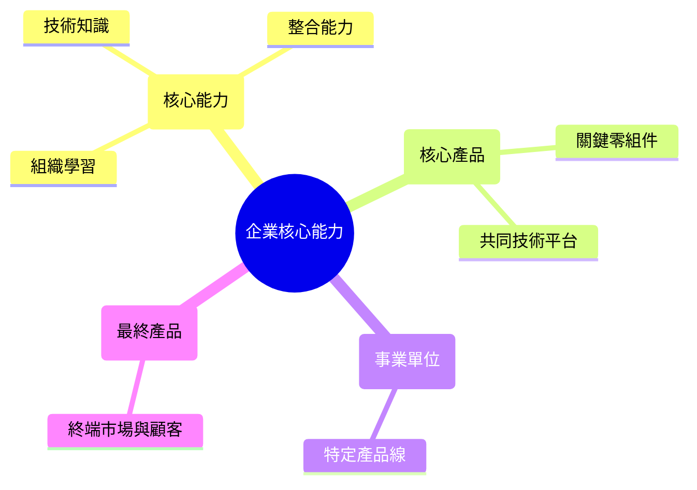
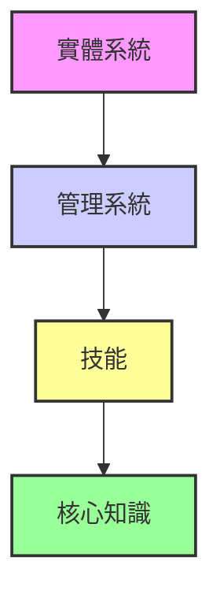

# 第一章 策略本質與架構

## 1. 策略的定義與價值

### 什麼是企業策略？

為什麼有些公司能**征服世界**，而一些公司卻消失無蹤？

秘密武器就是**策略**。

**策略**

公司為達成目標、獲取比競爭者更好績效所採取的一系列行動。

### 策略的三大支柱
1.  **定位**：創造獨特而有價值的定位。
2.  **取捨**：選擇不做哪些事。
3.  **契合**：讓各項企業活動彼此協調。
#### 三大支柱的意涵
*   定位
*   取捨
*   契合

一個好的策略就像一幅拼圖，每一片都必須**完美契合**。

## 2. 策略的基石：北極星

定義公司的宗旨與方向。

### 核心要素

#### 使命 (Mission)

企業的根本宗旨，回答「為何而存在？」，並引導企業發展成長。

#### 願景 (Vision)

企業渴望成為的樣貌，是追求的最終目標與目的。
分為三個部分
1. 方向
2. 發現
3. 命運

#### 價值觀 (Values)

引導企業所有行動與決策的原則，也被稱為經營理念或核心價值。

### 頂尖公司的實踐

| 公司 | 使命 | 願景 | 經營理念 |
| :--- | :--- | :--- | :--- |
| 台積電 | 長期信賴的技術及產能提供者 | 全球最先進的專業IC服務業者 | 誠信正直、創新、客戶信任 |
| 王品集團 | 提供優質餐飲體驗、善盡社會責任 | 成為全球最優質的連鎖餐飲集團 | 誠實、群力、創新、滿意 |
| 研華 | 成為物聯網最具影響力的全球企業 | 智能地球的推手、卓越產業領導者 | 誠信篤實、以人為本、卓越創新 |

## 3. 策略藍圖與分析框架

建立策略的框架

### 建立策略藍圖的步驟

1.  **建立使命、願景與目標**：確立公司的方向與終點。
2.  **分析外部環境**：了解市場的機會與威脅。
3.  **分析內部環境**：了解組織的優點與缺點。
4.  **策略選擇**：建立在優勢上並利用機會。
5.  **策略執行**：有效發揮資源與能力以達成目標。

#### 策略: 活的指引
公司需要策略才能贏。  
那**你的策略是什麼**？

### 策略規劃程序 
1. 使命宣言
2. 外部分析
3. 內部分析
4. 策略選擇

#### 環境分析

##### 總體環境
1. 政治
2. 經濟
3. 社會
4. 科技
5. 法律
6. 環境
7. 人口統計
8. 全球化

##### 內部環境分析
1. 資源
2. 能力
3. 核心能力

#### 目標管理
短期目標3年內 長期目標 10年以上

目標訂定[[ Grimoires/smart-principles|SMART原則]]

目標與關鍵成果[[OKR(我會這個東西但須要補上教學文件)]]

執行工具[[CFR(OKR執行工具我覺得應該可以拉一篇單獨講一下不要放在OKR裡面)]]

#### CAMEC 管理學習模式

#### 分析工具：SWOT
| 內部環境 | 外部環境 |
| :--- | :--- |
| **優勢 (Strengths)** | **機會 (Opportunities)** |
| **劣勢 (Weaknesses)** | **威脅 (Threats)** |

# 第二章 外部分析:總體、國家與產業環境
#### 策略家的望遠鏡:外部分析指南

外部分析的目的是辨識市場中的機會與威脅，為策略制定提供基礎。

## 1. 總體環境分析

檢視影響所有產業的廣泛因素。

### PEST 分析

- **P**olitical (政治)
- **E**conomic (經濟)
- **S**ocial (社會)
- **T**echnological (科技)
- _註：此處可擴展至 PESTEL，包含 Legal (法律) 和 Environmental (環境)_

## 2. 國家競爭優勢 

### 波特鑽石模型 

解釋特定產業為何在某個國家變得極具競爭力：

- 資源稟賦 
- 當地需求
-  策略、結構與競爭強度
- 相關及支援產業
兩大變數 
1. 政府角色
2. 事件機會
## 3. 產業環境分析

### 波特五力分析

供應商、同業、買方、潛在競爭者與替代品這五個方向用來評估特定產業的結構吸引力和長期獲利潛力。並用來找到機會與威脅。

#### 競爭結構分為:
	1. 獨佔
	2. 寡占
	3. 完全競爭

#### 競爭強度受到以下幾點影響:
1. 產業規模
2. 需求狀況
3. 成本條件
4. 退出障礙

#### 買方議價能力受到以下幾點影響:
1. 市場規模與數目
2. 購買數量
3. 買方地位
4. 產品性質
5. 購買來源
6. 垂直整合

#### 供應商議價能力受到以下幾點影響:
1. 供應商集中度
2. 供應產品替代性
3. 焦點廠商重要性
4. 產品性質
5. 垂直整合

#### 潛在競爭者進入的障礙有:
1. 規模經濟
2. 品牌忠誠度
3. 成本優勢
4. 顧客轉換成本
5. 政府法規

#### 替代品的威脅有:
1. 轉換成本
2. 性價比
3. 功能包絡

## 4. 策略群組

- 洞察重點：識別在同一產業中採取相似策略的競爭者集合。

# 期中考重點複習
### 一、選擇題

1. 地球溫室效應、環境污染是指？  
    (1)科技因素 (2)社會因素 (3)**環境因素**。P.31
2. 鑽石模型主要用來解釋為何特定國家的優勢產業會優於其他國家，並達到持續的競爭優勢，提出的學者是？  
    (1)**Porter** (2)Kolter (3)Hamel。P.34
3. 產業的吸引力最適合用哪一種分析？  
    (1)**五力分析** (2)性價比 (3)公司產能。P.45
4. 品牌、商譽、專利、技術、行銷及知識等項目是指？  
    (1)有形資源 (2)**無形資源** (3)無形能力。P.56
5. 企業可透過同心圓模型來強化現有或增加新的核心能力。若是沒有隨著環境變動來調整其核心能力，常會陷入何種困境？  
    (1)**核心僵固** (2)核心承諾 (3)核心彈性。P.69
6. 人力資源與物料管理是屬於？  
    (1)主要活動 (2)**支援活動** (3)次要活動。P.71
7. 現今企業以競爭為核心，以打敗競爭對手為目的的策略是？  
    (1)藍海策略 (2)**紅海策略** (3)黑海策略。P.102
8. 下列何者不是阻絕新競爭者進入的方法？  
    (1)殺價競爭 (2)維持超額產能 (3)**產品減產**。P.129
9. 開放式創新包括？  
    (1)開放式知識 (2)開放式生態系統 (3)**以上皆是**。P.167
10. 先行者因為最早進入市場而可能帶來優勢，相對地，企業可能也會因為領先發展推出新產品或經營模式到市場上而產生一些劣勢，稱為先行者劣勢，下列何者非先行者劣勢？  
    (1)開拓成本 (2)**規模經濟** (3)容易犯錯。P.199

### 二、簡答題

1. 在總體環境對企業的經營有重大影響，請問影響因素有那些？請至少說明兩項。P.26-P.32
2. 價值鏈定義為公司將投入轉換成產出，提供顧客價值的所有相關活動，包括主要活動與支援活動，請問支援活動包括那四項？請至少說明兩項。P.71
3. Porter(1980)所提出一般性事業層級策略包括那些？請至少說明兩種。P.93
4. 促成贏家通吃的可能因素有哪些？請至少說明兩項。P.161
5. 佛斯特(Richard Foster)觀察科技發展歷程而歸納出的軌跡模型稱之為科技 S 曲線，請問科技 S 曲線包括那三個階段？請至少說明兩個。P.182

# 第三章 內部分析:資源、能力與競爭優勢

## 3.1 企業資源

### 1. 資源基礎觀點 (RBV) 與 VRIN 分析
企業若要獲得持久的競爭優勢，必須擁有的資源具備以下四項特性：
1. **價值 (Value)**：資源是否能幫助企業利用機會或抵禦威脅，創造價值。
2. **稀少性 (Rarity)**：該資源是否為競爭對手所缺乏，且不為市場多數人擁有。
3. **不可模仿性 (Inimitability)**：競爭對手是否難以複製或取得相同的資源（如因歷史背景、模糊的因果關係或複雜的社會關係）。
4. **不可替代性 (Non-substitutability)**：市場上是否存在其他資源能達到同樣的績效，若無，則具備策略優勢。
_出處：Jay Barney (1991), "Firm Resources and Sustained Competitive Advantage"._

### 2. 有形與無形資源
**有形資源**：實體資產。
**無形資源**：
	*   容易被低估的有**品牌資產**&**商譽**
	*   行銷知識

### 3. 微笑曲線 (Smile Curve)
微笑曲線是 1992 年時，當時的**宏碁電腦董事長施振榮**在《再造宏碁：創、成長與挑戰》一書中所提出的**企業競爭戰略**。

微笑曲線分成左、中、右三段，左段為**技術**、**專利**，中段為**組裝**、**製造**，右段為**品牌**、**服務**，而曲線代表的是附加價值，微笑曲線在中段位置的附加價值較低，而在左右兩段位置的附加價值較高。要增加企業的**附加價值**，絕不是持續在組裝、製造位置，而是往左端或右端位置邁進。

## 3.2 企業能力

企業將資源轉化為競爭優勢的整合性行為。

### 1. 系統別分類
1. **組織結構 (Organizational Structure)**：決定權責劃分、溝通路徑與決策流程，確保組織能有效回應環境。
2. **控制系統 (Control Systems)**：績效衡量指標與管理程序，用以監控策略執行狀況（如目標管理、KPI/OKR）。
3. **組織文化 (Organizational Culture)**：內部共有的價值觀、信念與行為規範，影響員工如何面對挑戰與進行日常決策。

### 2. 功能別分類
1. 策略規劃 
2. 研發創新
3. 生產製造 
4. 物料管控 
5. 銷售通路 
6. 行銷通路 
7. 行銷廣告 
8. 資訊整合
9. 用人培訓 
10. 財務控管

### 3. 核心能力模型

#### A. 大樹模型 (Core Competence Tree)
由 C.K. Prahalad 與 Gary Hamel 提出，將企業比喻為一棵樹：

_核心意涵：企業的成長動力源自根部的「核心能力」，透過樹幹的「核心產品」支撐樹枝的各項事業，最終結出「最終產品」。_

#### B. 同心圓模型 (能力構面)
四大構面：**實體系統**、**管理系統**、**技能**、**知識**。核心能力由內而外擴散：
1. **核心知識 (Knowledge)**：最內層，企業的技術基礎與智慧結晶。
2. **技能 (Skills)**：應用核心知識的實作能力。
3. **管理系統 (Management Systems)**：協調與分配資源的流程。
4. **實體系統 (Physical Systems)**：最外層，組織的硬體基礎設施與生產體系。

## 3.3 知識與能力管理 (輸入知識)

### 1. NIH (Not Invented Here) 非我發明症候群
一種負面的企業文化心理現象，指團隊傾向於排斥來自外部的構想、技術與產品。
 **盲目排外**：認為外部開發的技術「不夠好」或「不符合我們的標準」。
 **重複造輪子 (Reinventing the wheel)**：寧願重新研發已有的解決方案。
**心理防衛**：擔心接受外部建議會顯得無能。

### 2. 執行整合
執行者參與模式：交付模式、諮詢模式、共同開發、見習模式。

### 3. 解決問題機制
**創造性摩擦 (Creative Abrasion)**：不同觀點、專業背景在互動時產生的能量與火花。處理得當能產生突破性創新；處理不當則演變成破壞性爭吵。
 **招牌技巧管理 (Signature Skill Management)**：組織所擁有一組獨特、難以模仿、且能持續產生價值的核心能力組合。
**功能固著**：可用上述兩項機制管理。

### 4. 進行實驗

## 3.4 價值鏈與價值創造

### 1. 價值鏈分析 (The Value Chain)

波特認為企業是一連串用以設計、生產、行銷、交貨以及支援其產品的活動集合。

- **主要活動 (Primary Activities)**：直接參與產品的實體創造、銷售及移轉給買方的活動。
    - 進料後勤、生產作業、出貨後勤、行銷與銷售、售後服務。
- **支援活動 (Support Activities)**：支援主要活動並彼此支援的活動。
    - 採購、技術發展（研發）、人力資源管理、企業基礎建設（財務、法令等）。
- **毛利 (Margin)**：總價值與執行價值活動之總成本之間的差額。

### 2. 價值、價格與成本 (V-P-C)

企業創造價值的核心在於擴大**價值 (Value)** 與 **成本 (Cost)** 之間的差距。

- **價值 (Value, V)**：買方願意為企業提供的產品所支付的金額。
- **價格 (Price, P)**：產品在市場上的實際售價。
- **成本 (Cost, C)**：執行價值鏈活動所產生的費用。
- **消費者剩餘**：V - P（顧客感知的價值高於支付的價格）。
- **企業利潤**：P - C（企業獲取價值的能力）。

> **競爭優勢的來源**：來自於企業能以比競爭對手更低的成本執行活動（成本優勢），或是以獨特的方式執行活動以創造差異化（差異化優勢）。

## 3.5 競爭優勢

### 1. 成本領導優勢

藉由較低的成本結構來取得價格上的優勢，獲取較高的市占率；或是允許企業在相同的價格制定下，相較於競爭者獲取每單位較高的報酬。

#### 影響因素

1. **投入成本**：獲取低成本的原料或勞動力。
2. **規模經濟**：隨產量增加，單位固定成本下降。
3. **學習曲線**：隨著累積產量增加，員工熟練度提升導致單位成本下降。
4. **生產技術**：透過製程創新、自動化設備或專利技術提升效率，降低資源耗損。
5. **標準化**：減少產品變異與製程切換成本，實現大規模穩定生產。
6. **專業分工**：將複雜任務拆解，讓員工專注特定環節以提高生產速率。
7. **產能利用率**：維持高稼動率（即「實際產能 / 設計產能」的比率），確保設備沒在閒置，藉此分攤掉昂貴的折舊與維護成本。

#### 學習曲線 (Learning Curve)

學習曲線是對某種活動或工具的學習速率的圖形化表示。

- **初期階段**：掌握信息的速率最為陡峭，代表初步掌握的速度最快。
- **後期階段**：曲線逐漸變得平緩，表明對新資訊的掌握速率會越來越慢。
- **意涵**：表示剛開始學習某件事的困難程度，以及在初步掌握之後還能學到多少更高階的知識。

### 2. 差異化優勢
1. **差異化優勢**: 企業提供被顧客視為具備「獨特性」且「有價值」的產品或服務，使其願意支付溢價（Premium Price），進而超越競爭對手。
2. **產品獨特性**: 獨特的功能、設計或卓越的性能。
3. **品質與可靠度**: 產品更耐用、故障率低，減少顧客的後續維護成本。
4. **品牌信譽**：透過行銷與長期口碑建立的心理價值與社會地位象徵。
5. **市場需求**：精準切入特定分眾市場（Niche Market），提供最符合該族群需求的特化產品。
6. **顧客回應**：優異的售後服務、極速的交期，或是針對顧客問題提供即時且專業的解決方案。
7. **優質投入**：選用比對手更高規格的原材料、引進頂尖人才，從源頭確保產出的卓越性。

> **核心邏輯**：差異化的關鍵在於增加顧客的「感知價值 (V)」，只要增加的價值大於為了達成差異化所投入的成本 (C)，企業就能獲取超額利潤。

### 3. 雙重優勢 (Dual Advantage)

企業同時追求**低成本**與**差異化**。這通常被認為極具挑戰性（避免陷入「卡在中間」的困境），但能透過技術創新或營運效率達成。

- **核心邏輯**：利用標準化零件達成規模經濟（低成本），同時透過模組化設計提供多樣化選擇（差異化）。
- **範例：IKEA**
    - **低成本**：平整包裝減少運輸成本、顧客自提自組、郊區大賣場。
    - **差異化**：獨特的北歐設計風格、沉浸式商場體驗、強大的品牌形象。

### 4. 持久競爭優勢 (Sustainable Competitive Advantage)

競爭優勢能否持久，取決於模仿障礙的高低。可從以下四個面向評估：

1. **產業發展**：外部環境與科技演進是否會令現有優勢過時（如底片產業受數位化衝擊）。
2. **競合狀況**：競爭對手的反應速度與替代品的威脅。
3. **企業本身**：是否具備 **VRIN** 特性的資源，特別是隱性知識與獨特文化。
4. **策略承諾 (Strategic Commitment)**：企業對特定發展方向的長期投入與資源鎖定，這種「不可逆性」能嚇阻對手進入。

- **範例：台積電 (TSMC)**
    - **產業發展**：持續投資最先進製程（摩爾定律）。
    - **競合狀況**：純代工模式避免與客戶競爭，建立強大生態系（Grand Alliance）。
    - **企業本身**：極高的良率、卓越的研發人才與嚴密的智財權保護。
    - **策略承諾**：每年數百億美金的資本支出（CAPEX），讓競爭對手難以跟進規模。

# 第四章 事業策略與競合思維
## 1. 事業策略

### 1. 事業策略本質

事業策略的核心在於：**企業如何在特定的產業中，建立優於競爭對手的長期獲利地位。**
### 2. 競爭策略類型

波特主張企業應依據「競爭優勢」與「市場範疇」兩個維度進行策略矩陣定位：

|競爭優勢 \ 市場範疇|廣泛市場 (Broad Target)|狹窄市場 (Narrow Target)|
|:--|:--|:--|
|**低成本**|**成本領導策略**|**成本集中策略**|
|**差異化**|**差異化策略**|**差異化集中策略**|

- **成本領導策略**：在廣泛的產業中，追求全產業的最低成本結構。
- **差異化策略**：在廣泛的產業中，創造被顧客視為獨特且具備溢價的產品屬性。
- **集中策略 (Focus)**：專注於特定的細分市場（利基市場），針對該區隔追求成本優勢或差異化特色。
- **卡在中間 (Stuck in the Middle)**：未能明確選擇上述定位，導致資源分散，最終無法在任何層面建立有效的競爭優勢。

### 3. 差異化策略 (Differentiation Strategy)

透過產品與服務的獨特性，使顧客產生偏好，進而建立競爭壁壘。

#### 優勢

1. **品牌忠誠度**：獨特的產品屬性建立情感連結，提高顧客重複購買率，降低對價格的敏感度。
2. **提升議價能力**：因產品具有高度替代性，顧客難以找到完全相同的替代品，企業在與買方議價時更具主導權。
3. **高額溢價 (Premium Pricing)**：顧客願意為「品質」、「技術」或「品牌象徵」支付更高的價格，從而獲得高利潤率。
4. **進入障礙**：強大的品牌聲譽與獨特技術專利，使新進入者難以輕易模仿。

#### 風險與劣勢

1. **高額研發與行銷成本**：為了維持獨特性，必須持續投入高額的開發成本與品牌行銷預算。
2. **價格劣勢**：當產品價格與非差異化產品差距過大時，部分價格敏感型顧客可能會流向平價替代品。
3. **稀釋風險**：過度擴張品牌導致產品線雜亂，可能稀釋原本核心的差異化價值。
4. **模仿威脅**：隨著時間推移，技術進步或競爭對手可能快速追上，導致「獨特性」變成了「產業標配」。

### 4. 成本領導策略

企業透過效率提升與規模經濟，成為產業中成本最低的生產者。

#### 優勢

1. **抗衡價格競爭**：在價格戰中比對手更有生存空間，即使在對手虧損時仍能獲利。
2. **提高議價能力**：大規模採購增加對供應商的談判籌碼；面對強大買方時，也有較多降價空間可吸收。
3. **建立進入障礙**：巨大的規模經濟與經驗曲線效應，讓新進入者難以在初期取得競爭優勢。
4. **抵禦替代品**：較低的售價能吸引對價格敏感的顧客，降低其轉向替代品的動機。

#### 風險與劣勢

1. **技術過時**：競爭對手可能透過突破性技術（如自動化或新製程）直接跨越現有的成本優勢。
2. **易被模仿**：低成本的製程或管理模式若缺乏專利保護，容易被競爭者快速學習與複製。
3. **忽略顧客需求**：過度專注於削減成本，可能導致產品品質、功能或服務無法滿足市場基本需求。
4. **價格戰消耗**：若多個競爭者同時採取此策略，可能演變成惡性價格競爭，導致全產業獲利能力下降。

### 5. 集中化策略

企業專注於特定的細分市場（利基市場），針對該區隔追求成本優勢或差異化特色。

#### 優勢

1. **深耕利基市場**：對特定客群的需求有極深理解，能提供比廣泛市場競爭者更貼合需求的產品或服務。
2. **避開正面衝突**：專注於大企業忽略或不屑經營的小眾市場，減少與產業巨頭直接競爭的壓力。
3. **資源高效配置**：將有限資源集中於特定領域，在該細分市場中建立極高的專業壁壘。
4. **高度顧客忠誠**：專門的服務與品牌定位，易與特定社群建立強烈的情感連結與重複購買率。

#### 風險與劣勢

1. **市場容量限制**：細分市場規模有限，若市場過於狹小，可能限制企業的成長空間與營收上限。
2. **區隔消失風險**：當細分市場的需求與廣泛市場逐漸趨同，集中化的獨特優勢將會消失。
3. **大廠反撲入侵**：大型競爭者可能透過更精細的子品牌策略進入該利基市場，利用規模優勢進行瓜分。
4. **結構性變動**：該利基市場可能因技術更迭或消費習慣改變而萎縮，導致企業缺乏轉型的緩衝空間。