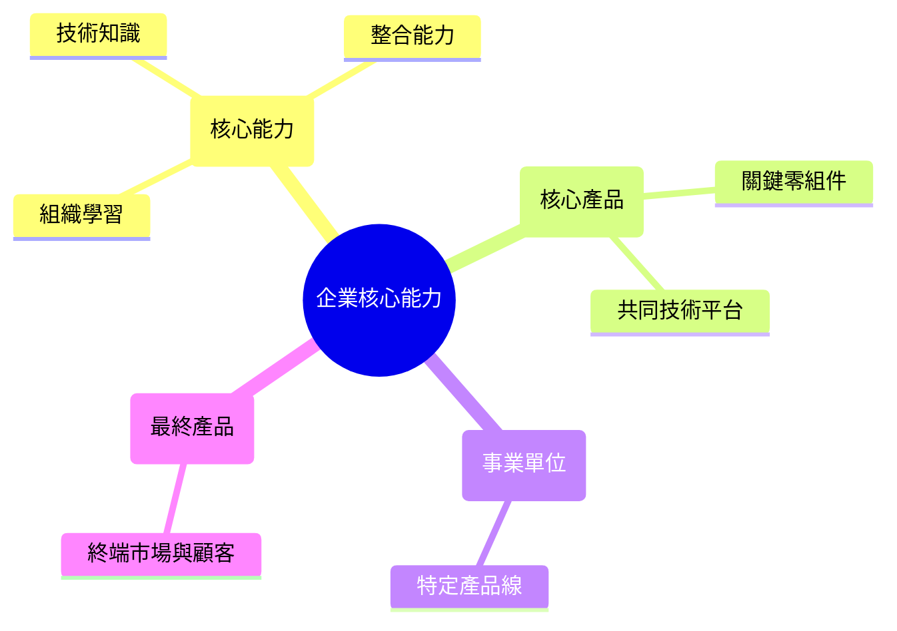
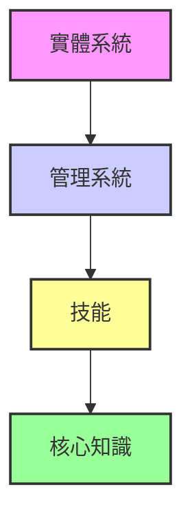

# 第一章 策略本質與架構

## 1. 策略的定義與價值

### 什麼是企業策略？

為什麼有些公司能**征服世界**，而一些公司卻消失無蹤？

秘密武器就是**策略**。

**策略**

公司為達成目標、獲取比競爭者更好績效所採取的一系列行動。

### 策略的三大支柱
1.  **定位**：創造獨特而有價值的定位。
2.  **取捨**：選擇不做哪些事。
3.  **契合**：讓各項企業活動彼此協調。
#### 三大支柱的意涵
*   定位
*   取捨
*   契合

一個好的策略就像一幅拼圖，每一片都必須**完美契合**。

## 2. 策略的基石：北極星

定義公司的宗旨與方向。

### 核心要素

#### 使命 (Mission)

企業的根本宗旨，回答「為何而存在？」，並引導企業發展成長。

#### 願景 (Vision)

企業渴望成為的樣貌，是追求的最終目標與目的。
分為三個部分
1. 方向
2. 發現
3. 命運

#### 價值觀 (Values)

引導企業所有行動與決策的原則，也被稱為經營理念或核心價值。

### 頂尖公司的實踐

| 公司 | 使命 | 願景 | 經營理念 |
| :--- | :--- | :--- | :--- |
| 台積電 | 長期信賴的技術及產能提供者 | 全球最先進的專業IC服務業者 | 誠信正直、創新、客戶信任 |
| 王品集團 | 提供優質餐飲體驗、善盡社會責任 | 成為全球最優質的連鎖餐飲集團 | 誠實、群力、創新、滿意 |
| 研華 | 成為物聯網最具影響力的全球企業 | 智能地球的推手、卓越產業領導者 | 誠信篤實、以人為本、卓越創新 |

## 3. 策略藍圖與分析框架

建立策略的框架

### 建立策略藍圖的步驟

1.  **建立使命、願景與目標**：確立公司的方向與終點。
2.  **分析外部環境**：了解市場的機會與威脅。
3.  **分析內部環境**：了解組織的優點與缺點。
4.  **策略選擇**：建立在優勢上並利用機會。
5.  **策略執行**：有效發揮資源與能力以達成目標。

#### 策略: 活的指引
公司需要策略才能贏。  
那**你的策略是什麼**？

### 策略規劃程序 
1. 使命宣言
2. 外部分析
3. 內部分析
4. 策略選擇

#### 環境分析

##### 總體環境
1. 政治
2. 經濟
3. 社會
4. 科技
5. 法律
6. 環境
7. 人口統計
8. 全球化

##### 內部環境分析
1. 資源
2. 能力
3. 核心能力

#### 目標管理
短期目標3年內 長期目標 10年以上

目標訂定[[ Grimoires/smart-principles|SMART原則]]

目標與關鍵成果[[OKR(我會這個東西但須要補上教學文件)]]

執行工具[[CFR(OKR執行工具我覺得應該可以拉一篇單獨講一下不要放在OKR裡面)]]

#### CAMEC 管理學習模式

#### 分析工具：SWOT
| 內部環境 | 外部環境 |
| :--- | :--- |
| **優勢 (Strengths)** | **機會 (Opportunities)** |
| **劣勢 (Weaknesses)** | **威脅 (Threats)** |

# 第二章 外部分析:總體、國家與產業環境
#### 策略家的望遠鏡:外部分析指南

外部分析的目的是辨識市場中的機會與威脅，為策略制定提供基礎。

## 1. 總體環境分析

檢視影響所有產業的廣泛因素。

### PEST 分析

- **P**olitical (政治)
- **E**conomic (經濟)
- **S**ocial (社會)
- **T**echnological (科技)
- _註：此處可擴展至 PESTEL，包含 Legal (法律) 和 Environmental (環境)_

## 2. 國家競爭優勢 

### 波特鑽石模型 

解釋特定產業為何在某個國家變得極具競爭力：

- 資源稟賦 
- 當地需求
-  策略、結構與競爭強度
- 相關及支援產業
兩大變數 
1. 政府角色
2. 事件機會
## 3. 產業環境分析

### 波特五力分析

供應商、同業、買方、潛在競爭者與替代品這五個方向用來評估特定產業的結構吸引力和長期獲利潛力。並用來找到機會與威脅。

#### 競爭結構分為:
	1. 獨佔
	2. 寡占
	3. 完全競爭

#### 競爭強度受到以下幾點影響:
1. 產業規模
2. 需求狀況
3. 成本條件
4. 退出障礙

#### 買方議價能力受到以下幾點影響:
1. 市場規模與數目
2. 購買數量
3. 買方地位
4. 產品性質
5. 購買來源
6. 垂直整合

#### 供應商議價能力受到以下幾點影響:
1. 供應商集中度
2. 供應產品替代性
3. 焦點廠商重要性
4. 產品性質
5. 垂直整合

#### 潛在競爭者進入的障礙有:
1. 規模經濟
2. 品牌忠誠度
3. 成本優勢
4. 顧客轉換成本
5. 政府法規

#### 替代品的威脅有:
1. 轉換成本
2. 性價比
3. 功能包絡

## 4. 策略群組

- 洞察重點：識別在同一產業中採取相似策略的競爭者集合。

# 期中考重點複習
### 一、選擇題

1. 地球溫室效應、環境污染是指？  
    (1)科技因素 (2)社會因素 (3)**環境因素**。P.31
2. 鑽石模型主要用來解釋為何特定國家的優勢產業會優於其他國家，並達到持續的競爭優勢，提出的學者是？  
    (1)**Porter** (2)Kolter (3)Hamel。P.34
3. 產業的吸引力最適合用哪一種分析？  
    (1)**五力分析** (2)性價比 (3)公司產能。P.45
4. 品牌、商譽、專利、技術、行銷及知識等項目是指？  
    (1)有形資源 (2)**無形資源** (3)無形能力。P.56
5. 企業可透過同心圓模型來強化現有或增加新的核心能力。若是沒有隨著環境變動來調整其核心能力，常會陷入何種困境？  
    (1)**核心僵固** (2)核心承諾 (3)核心彈性。P.69
6. 人力資源與物料管理是屬於？  
    (1)主要活動 (2)**支援活動** (3)次要活動。P.71
7. 現今企業以競爭為核心，以打敗競爭對手為目的的策略是？  
    (1)藍海策略 (2)**紅海策略** (3)黑海策略。P.102
8. 下列何者不是阻絕新競爭者進入的方法？  
    (1)殺價競爭 (2)維持超額產能 (3)**產品減產**。P.129
9. 開放式創新包括？  
    (1)開放式知識 (2)開放式生態系統 (3)**以上皆是**。P.167
10. 先行者因為最早進入市場而可能帶來優勢，相對地，企業可能也會因為領先發展推出新產品或經營模式到市場上而產生一些劣勢，稱為先行者劣勢，下列何者非先行者劣勢？  
    (1)開拓成本 (2)**規模經濟** (3)容易犯錯。P.199

### 二、簡答題

1. 在總體環境對企業的經營有重大影響，請問影響因素有那些？請至少說明兩項。P.26-P.32
2. 價值鏈定義為公司將投入轉換成產出，提供顧客價值的所有相關活動，包括主要活動與支援活動，請問支援活動包括那四項？請至少說明兩項。P.71
3. Porter(1980)所提出一般性事業層級策略包括那些？請至少說明兩種。P.93
4. 促成贏家通吃的可能因素有哪些？請至少說明兩項。P.161
5. 佛斯特(Richard Foster)觀察科技發展歷程而歸納出的軌跡模型稱之為科技 S 曲線，請問科技 S 曲線包括那三個階段？請至少說明兩個。P.182

# 第三章 內部分析:資源、能力與競爭優勢

## 3.1 企業資源
- 有形資源
	企業若要獲得持久的競爭優勢，必須擁有的資源具備以下四項特性：
	1. **價值 (Value)**：資源是否能幫助企業利用機會或抵禦威脅，創造價值。
	2. **稀少性 (Rarity)**：該資源是否為競爭對手所缺乏，且不為市場多數人擁有。
	3. **不可模仿性 (Inimitability)**：競爭對手是否難以複製或取得相同的資源（如因歷史背景、模糊的因果關係或複雜的社會關係）。
	4. **不可替代性 (Non-substitutability)**：市場上是否存在其他資源能達到同樣的績效，若無，則具備策略優勢。
	_出處：Jay Barney (1991), "Firm Resources and Sustained Competitive Advantage"._
	
- 無形資源
	- 容易被低估的有**品牌資產**&**商譽**
	- 行銷知識

### 微笑曲線
微笑曲線 (Smile Curve) 是 1992 年時，當時的**宏碁電腦董事長施振榮**在《再造宏碁：創、成長與挑戰》一書中所提出的**企業競爭戰略**。

微笑曲線分成左、中、右三段，左段為**技術**、**專利**，中段為組裝、製造，右段為**品牌**、**服務**，而曲線代表的是附加價值，微笑曲線在中段位置的附加價值較低，而在左右兩段位置的附加價值較高，如此整個曲線看起來像個微笑符號。微笑曲線的含意即是：要增加企業的**附加價值**，絕不是持續在組裝、製造位置，而是往左端或右端位置邁進。

## 3.2 企業能力

企業將資源轉化為競爭優勢的整合性行為。

### 1. 系統別分類
1. **組織結構 (Organizational Structure)**：決定權責劃分、溝通路徑與決策流程，確保組織能有效回應環境。
2. **控制系統 (Control Systems)**：績效衡量指標與管理程序，用以監控策略執行狀況（如目標管理、KPI/OKR）。
3. **組織文化 (Organizational Culture)**：內部共有的價值觀、信念與行為規範，影響員工如何面對挑戰與進行日常決策。

### 2. 功能別分類
1. 策略規劃
2. 研發創新
3. 生產製造
4. 物料管控
5. 銷售通路
6. 行銷通路
7. 行銷廣告
8. 資訊整合
9. 用人培訓
10. 財務控管

### 3. 核心能力
1. 本質與模型: **企業核心能力**公司能夠協調及整合資源，使其產生高生產力及高績效的一種能力。
	1. 大樹模型
		由 C.K. Prahalad 與 Gary Hamel 提出，將企業比喻為一棵樹：

企業核心能力核心能力核心產品事業單位最終產品技術知識整合能力組織學習關鍵零組件共同技術平台特定產品線終端市場與顧客

_核心意涵：企業的成長動力源自根部的「核心能力」，透過樹幹的「核心產品」支撐樹枝的各項事業，最終結出「最終產品」。_

2. 構面與活動: **同心圓模型**四大構面**實體系統**、**管理系統**、**技能**、**知識**

核心能力並非單一要素，而是透過四個層次的構面由內而外擴散：

1. **核心知識 (Knowledge)**：最內層，企業的技術基礎與智慧結晶。
2. **技能 (Skills)**：應用核心知識的實作能力。
3. **管理系統 (Management Systems)**：協調與分配資源的流程。
4. **實體系統 (Physical Systems)**：最外層，組織的硬體基礎設施與生產體系。

_含義：企業核心能力需具備層次感，從最核心的知識轉化為具體的實體產品，層層協調方能發揮綜效。_
## 輸入知識
### NIH (Not Invented Here) 非我發明症候群

在商業與組織管理中，NIH 是 **Not Invented Here (非我發明症候群)** 的縮寫。這是一種負面的企業文化心理現象，指一個團隊或組織傾向於排斥、拒絕來自外部或他人的構想、技術與產品。這種現象通常源於對外部事物的不信任，或是過度自信於內部的研發能力。

#### NIH 的主要特徵

- **盲目排外**：認為外部開發的技術「不夠好」、「不專業」或「不符合我們的標準」。
- **重複造輪子 (Reinventing the wheel)**：寧願投入大量資源重新研發一套已有的解決方案，也不願直接採購或授權外部成熟的產品。
- **心理防衛**：團隊擔心接受外部建議會顯得自己無能，或導致內部預算與人力被縮減。

### 執行整合
### 解決問題
	功能固著:可用"創造性摩擦"、"招牌技巧管理"
	創造性摩擦 (Creative Abrasion)
	由 Dorothy Leonard 提出。這指的不是人際關係的衝突，而是指不同觀點、專業背景或思考風格在互動時產生的能量與火花。
	- 正面效果：若處理得當，這種「摩擦」能產生突破性的創新。
	- 負面效果：若處理不當，則會演變成破壞性的爭吵。
	招牌技巧管理 (Signature Skill Management)
		有時也被稱為「核心技能」或「招牌專長」，由 Dorothy Leonard 教授提出。這指的並非單純的專業知識，而是組織或個人所擁有一組獨特、難以模仿、且能持續產生價值的核心能力組合。
		
### 進行實驗
	